Seattle Municipal Archives

Moving Images Manual: QCTools

**Seattle Municipal Archives**

Moving Images Manual: QCTools

This manual contains material from the following contributors:

A/V Artifact Atlas

Bay Area Video Coalition (BAVC)

BlackMagic Design

Moving Image Preservation of Puget Sound (MIPoPS)

Rosemary Carroll

Anne Frantilla

Libby Hopfauf

Hannah Palin

Rachel Price

Dave Rice

Seattle Municipal Archives (SMA)

Carol Shenk

() 2015 Seattle Municipal Archives

City Hall, 600 Fourth Avenue • Third Floor

Seattle, WA 98124-4728

\(206) 233-7807 • (206) 684-8353

**How to Use This Manual**

Below are explanations of the information icons and color coding that
appears throughout this manual. This is to help the user find what they
need in an efficient and intuitive manner. A glossary of video and
technical terms is located in the back of the manual, along with quick
image reference of possible video artifacts.

**ICON KEY**

######## **icon key**

For Your Information

1.  Additional Resource

**For Your Information:** This icon will appear within a purple box
throughout the manual to provide addition information about a section.

**Additional Resources:** This icon will mark places in the manual where
addition information may be found in another section. For each
reference, the section will be noted.

**COLOR KEY**

######## **Color key**

**Purple** Chapter Headings

**Lavender** Section Headings

**Blue** Actions

**Orange** Titles

**Salmon** Terms

**Purple:** Chapter headings

**Lavender:** Section headings

**Blue:** Actions, buttons, icons to click or select

**Orange:** Titles of programs, site, resource, and windows

> **Salmon:** First occurrence of a glossary term

For more information on graphs and playback filters, consult the BAVC’s
**QCSchool: A blog series for users of QCTools.** As of September 17,
2015, only two posts exist. As more are posted, I will incorporate them
into the manual.

 **Getting Started**

**Introduction**

QCTools by double clicking the icon on the Dock.

**Add Files:** click the in the upper left hand corner and select the
desired video file from the pop-up window. Once your files have been
added, the preprogramed selection of graphs will begin running and you
will see the lines begin to populate horizontally along each.
Alternatively, you can open the Finder, navigate to the desired file,
then drag and drop it into the program window.

**Please Note:** Sometimes QCTools only will let you add via one of
these options. If one doesn’t work, try the other.

**Select and Navigate Graphs**

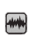
**Views**: QCTools automatically opens in **Graphs
Layout**. To view a list of your current video files, click the **View**
tab on the toolbar and select **File List**. To return and view the
graphs for the most recently viewed file (not necessarily the most
recently added), click the **View** tab on the toolbar and select
**Graphs Layout** from the dropdown menu. While in **File List** (Table)
view, you can also double click on a file and you will be taken to a
**Graphs Layout** of the corresponding video. You can also access these
different views by clicking on the corresponding icon.

**Table (File View): **

The Table View enables you to view the
progress of your file download, plus associated metadata:

In addition to technical metadata about the file (duration, frame rate,
file size, etc.) the List View also displays more detailed statistics
about the averages of your video levels over the duration of the file.
More columns exist, but the ones with information most helpful to you
are listed below:

  **Column Name **   **Description **                                                                                                             **Ideal Range**
  ------------------ ---------------------------------------------------------------------------------------------------------------------------- -----------------
  Yav                The average of the Y values (128)                                                                                            \~128
  Yrang              The average of the YHIGH and YLOW values (YHIGH-YLOW), which indicates the overall range of contrast                         \~128-219
  Uav                The average of the U values                                                                                                  \~128
  Vav                The average of the V values                                                                                                  \~128
  TOUTc              The number of frames with a TOUT value of more than 0.005                                                                    &lt;10
  SATb               The number of frames where the maximum saturation is over 88.7, which would indicate levels outside of the broadcast range   &lt;1000
  SATi               The number of frames where the maximum saturation is over 118.2, which would indicate levels outside the legal YUV values    &lt;1000
  BRNGav             The percentage of frames with a BRNG value of more than zero                                                                 &lt;0.02
  BRNGc              The number of frames with a BRNG value greater than 0.02                                                                     &lt;1000
  MSEfY              The number of frames with an MSEfY value over 1000                                                                           &lt;10

When checking for ideal range numbers mentioned throughout this manual,
use this view as an initial quick frame of reference.

**Graphs:** **Graphs** display on the top portion of the screen,
corresponding video thumbnails show below. The graph options (see image
below) are located along the top of the window. Each title is followed
by a check box. You can select or deselected any one(s) you want by
checking or unchecking the corresponding box.

**Video Thumbnails**: these are the squares (thumbnails of each frame)
scrolling along the bottom of the window. The video thumbnails may be
navigated via the **Next**, **Previous**, or; the frame and time for the
particular selection will be displayed below the center (or selected
frame). Clicking and dragging your cursor over a portion of the graph
will cause the thumbnails below to update accordingly to correspond with
the information. You may also double click a specific thumbnail and the
playback window will appear displaying the image and with a variety of
analytical playback filters.

**Levels:** Moving your cursor over a
particular point on a graph will reveal thesymbol in place of your
cursor’s usual arrow. This symbol appears very faint and is sometimes
hard to see; also you might have to try clicking around on the graph for
it to appear occasionally. By moving the symbol around the graph(s) with
your mouse, numbers will appear within a translucent black box,
displaying the frame number and plot values for the lines with in the
occupied graph. For example, Frame 15212: HUEMED = 125, HUE AVG = 122
(see image on right). This is helpful when making adjustments to the
video because you are more precisely able to decipher levels at
different points in the video. By clicking on a certain area of the
graph, the playback will automatically go to that point in the video
(displayed in the current frame thumbnail at the bottom of the window).

**Zoom:** You may also use the magnifying glass icons in the tool bar to
zoom in/out, giving you a more or less detailed view of the graph
displays, over a specific timespan of the uploaded video.

**keyboard shortcuts for Playback**

to (select the previous frame)

to (select the next frame)

**F** to enlarge the window to full screen

**SPACE** to toggle between and

**Video Analysis Window**

**Playback Filters:** to view a certain frame and apply the various
filters, double click on the thumbnail you want from the row along the
bottom and a pop-up window will appear with two views. This is called
the **Video Analysis Window**. In the upper left and right hand corners
are dropdown menus used to select the **playback filter(s)**
corresponding to the screen on their respective sides.

**Graph Descriptions **

**VOCABULARY**

**Graphs:** the QCTools “Help” documents refer to these graphs as “graph
filters” or “filters”. In order to reduce confusion (since there are
also “playback filters”) this manual refers to “graph filters” as
“graphs”.

**Plot**: is used here to refer to both the lines on the graph and the
action (verb) of the lines recording data (level values). Line(s) is
also used as a synonym for plot(s).

**Channels:** the contributing factors or signals making up the video
image.

**Levels:** are the measurements of each video channel/signal.

**Values:** refer to the unit of measurement and number of each level.
The values detailed below are appropriate for the 8-bit video samples
analyzed by this tool.

**IRE:** is a unit of measurement used in the analysis of composite
video signals. Its name is derived from the initials of the Institute of
Radio Engineers.

**INTRODUCTION**

**In General:** The QCTools graphs analyze the various values of an
encoded video file in order to provide information about the appearance
of the video based upon the levels of its channels. Each graph analyzes
a given channel and records the level values throughout the video. These
levels are plotted on the corresponding graph. By examining the graphs
alongside the playback, you will be able to identify problematic points,
what caused them, and, if possible, how to fix them.

**Keep in Mind:** Although some variations may apply depending on each
tape, in general the lines on all of these graphs should remain
relatively constant. On graphs with more than one plot (line), the lines
should remain relatively close together (except Y). For each graph
described below, there is an approximate **ideal range** for where the
lines should appear on the graph. If the lines are not exactly in this
spot, that is fine. The ideal range is merely a guide to help in
scanning for errors. Once an abnormality is spotted on the graph, it
makes it easier to use the playback filters to determine the cause and
any possible solutions. Not all abnormalities indicate an error and not
all errors can be fixed. Also, not all levels within the ideal range are
always correct. This can be ambiguous and confusing. Use them as a
guide, along with you judgement to make the video look as “good” as
possible with the fewest artifacts (errors).

**Additional Note:** Some of the graphs include more than one plot.
Refer to the color keys on the right-hand side of the window for details
of each. In general, they range in the following order: MIN, LOW,
AVG/MED, HIGH, MAX.

MIN = channel minimum

LOW = channel 10%\
AVG/MED = channel average/MEDIAN\
HIGH = channel 90%\
MAX = channel maximum

These measurements (low, minimum, maximum, high and average) are
contextual to each video it is analysis. For instance, the average line
is plotting the average level of Luma throughout the movie of the
current file.

**1. Y VALUES: Y MIN, Y LOW, Y AVG, Y HIGH, Y MAX **

  -------------------------------------------------------------------------------------------
  **Graph Domain **   **Graph Name(s) **                   **Values\* **   **Ideal Range**
  ------------------- ------------------------------------ --------------- ------------------
  Y Channel           Y MIN, Y LOW, Y AVG, Y HIGH, Y MAX   0-255 IRE       16 IRE (Y LOW)
                                                                           
                                                                           128 IRE (Y AVG)
                                                                           
                                                                           235 IRE (Y HIGH)
  -------------------------------------------------------------------------------------------

**Overview:** Y Channels carry data about the brightness of a picture or
**Luminance (Luma)**. Problematic variance in Y Channel values will
manifest as a picture that is either too light or too dark (contains
**noise**). 8-bit video will have values falling in the range of 0-255
code values per pixel. A picture with well-balanced light levels will
have an average (or mid-range Y Channel value) of around 128 (Y AVG).
Graph readings outside of that range will indicate a picture that is
either too bright or too dark. A Y Value of 0 would indicate total
blackness and a value of 255 would present as entirely white. In the
range of values, reference black is at value 16, while reference white
is at value 235. The information plotted here will reflect a similar
pattern to the Waveform monitor. Think of it like this graph is
recording the movement of the trace from the **Waveform** on the
BlackMagic Design Display.

On a Waveform, the Luma range is from 0-100 (7.5 to 100 Ideal). This
information is converted to the 0-255 (16-235 Ideal) scale when it is
digitized.

**The Lines:** The Y AVG, Y LOW and Y HIGH are the most important to pay
attention to on this graph. The Y AVG gives you an overall understanding
or feeling for the brightness of the video. The Y LOW and Y HIGH are
similar to the Y MIN and Y MAX filters, but instead of looking at the
absolute minimum and maximum value for these channels, it looks at the
10th percentile (LOW, or 16 pixels) and 90th percentile (HIGH, or 235
pixels) which present the outside limits or 'headroom' of the legal
broadcast range. An extreme minimum or maximum value could dramatically
skew the graph but because they may be outside the viewable broadcast
image (or the range of human perception), they may not necessarily be
meaningful indicators of a problematic visual image that can be
human-detectable. This is why Low/High measurements are so useful-- they
ignore the extreme outliers (Min/ Max) in favor of those abnormalities
which fall in the range of human perception. You want to make sure the Y
LOW stays above 16 IRE and that the Y HIGH stays below 235.

**How the Graph Should Look:** Except during particular moments like
scene changes where one might expect abrupt spikes, the values of Y
channels should remain relatively stable or constant with little
variation for the majority of the movie.

**Sample of Ideal Range:**

**Exceptions:** Portions of video showing extreme changes in average
values (and not corresponding to a scene change or otherwise dramatic
edit) likely indicate a picture error. Where you may expect Luma spikes
could be camera fade-ins/outs, or a sudden brightness in the picture,
like a camera flash, for example.

**Samples which demonstrate Y Value anomalies: **

**2. U, V Values: U MIN, U AVG, U MAX/ V MIN, V AVG, V MAX **

  **Graph Domain **   **Graph Name(s) **    **Values\* **   **Ideal Range**
  ------------------- --------------------- --------------- --------------------
  U Channel           U MIN, U AVG, U MAX   0-255 IRE       85-170 IRE (U AVG)
  V Channel           V MIN, V AVG, V MAX   0-255 IRE       85-170 IRE (V AVG)

**Overview:** The U and V Channels represent the **Chrominance**
**(Chroma)**, or color differences of a picture. U and V graphs act to
detect color abnormalities in video.

**The Lines:** It can be difficult to derive meaning from U or V values
on their own, but they provide supplementary information and can be good
indicators of artifacts, especially when occurring in tandem with
similar Y Value readings. Black and white video contains no chrominance
information so should present flat-lines (or no data) for UV channels.
Activity in UV Channels for black and white video content, however,
would certainly be an indication of **chrominance noise** (colorful
speckled movement or unintentional placement). Alternatively, a color
video which shows flat-lines (at 0) for these channels would be an
indicator of a color **drop-out** scenario.

**How the Graph Should Look:** Except during particular moments like
scene changes where one might expect abrupt spikes, the values of the U
and V channels should remain relatively stable or constant with little
variation for the majority of the movie. Spikes or extreme variation
could be an indicator of odd glowing or **noise**.

**Sample of Ideal Range: **

**Samples which demonstrate U/V Value anomalies: **

**3. YUV Values/ Difference **

  **Graph Domain **   **Graph Name(s) **
  ------------------- --------------------
  Y Channel           Y DIF
  U Channel           U DIF
  V Channel           V DIF

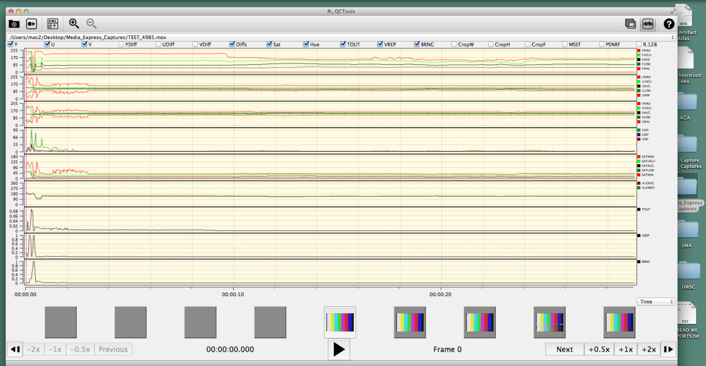

**Overview:** This QCTools graph selects two successive frames of video
and subtracts the values of one from the other in order to find the
change, or difference, between the two frames (measured in pixels). This
information indicates the rapidity with which a video picture is
changing from one frame to the next. Prolonged spikes (lasting past the
first few frames of a scene change) can represent a **head clog**.

**How the Graph Should Look:** All three lines should be relatively
close together and smooth. Aside from scene-change scenarios, a video
picture should not undergo dramatic changes in these values unless an
artifact is present. A scene-change would present as a short but
dramatic spike in the graph, and that is normal. Other YUV Difference
spikes may be present in cases where picture problems are visible.
Often, head problems with corrupted frames will result in large YUV
Difference values/graph spikes. This is also a good way to double check
your Chroma and Luma settings.

**Samples which demonstrate YUV Difference anomalies: **

**4. Saturation **

  **Graph Domain **   **Graph Name(s) **   **Values **   **Ideal Range**
  ------------------- -------------------- ------------- -----------------
  Saturation          Sat                  0-180         0.00-88.7

**Overview:** **Saturation** is a measure of the degree to which a color
is diluted with white light; in other words--how vivid or “true” a color
is. Low Saturation levels (**Undersaturation**) can cause colors to be
pale or washed out. Alternatively, when the Saturation levels are too
high (**Oversaturation**), the colors can appear unnaturally vibrant
and, sometimes, almost luminous. The Saturation graph is a good way to
compare the YUV graphs. If the UV plots are all in their ideal range,
but the Y graph and Saturation graph plots are not, this is an indicator
that your Luma levels are too high and causing the vividness of the
colors to be compromised. It can also be used to compare issues with Hue
or Chroma.

A **Vectorscope** view is a good way to see Saturation data--a large
plot area indicates much Saturation while a small plot area indicates
little to none.

**Ranges:** This graph does the equivalent of plotting all pixels in a
Vectorscope and measuring the distance from the plotted points (edge of
the Vectorscope trace) to the center of the Vectorscope. The MAX, MIN,
AVG, LOW and HIGH values for each frame are plotted. The **SAT AVG**
will provide an overall idea of how much color saturation exists within
a given frame. The plot for **SAT MAX** will highlight a number of
errors that cause color levels which exceed broadcast range (are
mathematically illegal). Values from **0** to **88.7** are considered
within the 75% chrominance broadcast range. Values from **88.7** to
**118.2** fall in-between the 75% and 100% chrominance broadcast ranges.
Values from **118.2** to **180** represent illegal YUV color data that
cannot be converted back to RGB without producing artifacts (negatives
or overflows). This is usually caused by TBC error or tape damage.

For examples of Over/Undersaturation, see **TBC Errors**. For more
information on Vectorscopes, consult the **Vectorscope Playback Filter**
section and the **Using the TBC with Scope Monitors** in the Processing
Manual.

**5. Hue **

  **Graph Domain **   **Graph Name(s) **   **Values **   **Ideal Range**
  ------------------- -------------------- ------------- -----------------
  Hue                 Hue                  0-360°        120-147°

**Hue** is another term used to describe color. In analyzing video, skin
tone is a good baseline to measure appropriate color representation and
balance. The Y axis values for the Hue graph correspond with the degree
measurements of the Vectorscope. Skin tone should fall in the 147°
range. If skin tone registers significantly above or below that number,
it's likely an indication that your video isn't accurately storing or
displaying color data accurately. When used in conjunction with the
Vectorscope, it is easier to adjust the Hue level to produce the correct
colors.

***Please note:*** Hue can be very tricky. The numbers above for the
suggested range are based on an image that is mostly of a person’s
face/skin (all/any skin colors). Having other objects in a variety of
colors will affect the reading. For example, if a person is wearing red,
the hue average will be much higher (closer to 147⁰-150⁰) or if he/she
is standing next to a bunch of trees on a bright day, the hue average
will be much lower (closer to 110⁰-125⁰). Both of these colors can
reflect onto the person’s and cause his/her skin to appear pink or
yellow/green, even when the hue is in balance. This is most problematic
with Umatic video

**For Reference:** the Hue filter measures G (green) at 38 degrees, Y
(yellow) at 99 degrees, R (red) at 161 degrees, M (magenta) at 218
degrees, B (blue) at 279 degrees, and C (cyan) at 341 degrees.

**Please Note:** Until I have a chance to talk to Dave regarding this
dramatic change, I would suggest using your best judgement, in
conjunction with the Vectorscope and employ the looser range of 128-147⁰
when measuring Hue in QCTools. Through my research, I only came across
small range (123-128⁰). I am not sure if Dave’s measurements correspond
specifically to our equipment/QCTools or if there is something I am
missing. More information soon.

**Sample of Ideal Range:**

For more information on Vectorscopes, consult the **Vectorscope Playback
Filter** section and the **Using the TBC with Scope Monitors** in the
Processing Manual. For more information on the Hue graph measurements,
look up the **Munsell** **Color** **System**.

**6. Temporal Outliers (TOUT) **

  **Graph Domain **   **Graph Name(s) **   **Values **   **Ideal Range**
  ------------------- -------------------- ------------- -----------------
  Temporal Outliers   TOUT                 0-1           0-0.009

**Overview:** This graph was created to detect white speckle noise in
analog VHS and 8mm video. It works by analyzing the current pixel
against the two above and below and calculates an average value. In
cases where the filter detects a pixel value which is dramatically
outside of this established average, the graph will show small spikes,
or blips, which correspond to white speckling in the video. The range of
0-0.009 could be considered normal and anything above that range may be
a quality error.

**How the Graph Should Look:** The plot should remain relatively flat
and as close to 0 as possible.

**Sample of Ideal Range:**

**Samples which demonstrate Temporal Outliers' anomalies: **

You can see several blips in the graph reading, especially around 7.5s,
15s, and 24s

For more information on TOUT graphs and playback filters, consult the
BAVC blog post **QCSchool: All About TOUT**.

****

**7. Vertical Line Repetitions (VREP) **

  **Graph Domain **           **Graph Name(s) **   **Values **   **Ideal Range**
  --------------------------- -------------------- ------------- -----------------
  Vertical Line Repetitions   VREP                 0-1           0

Vertical Line Repetitions, or the VREP graph, is useful in analyzing
U-Matic tapes and detecting artifacts generated in the course of the
digitization process. Specifically, VREP detects the repetition of lines
in a video. If a time base corrector (TBC) notices a video signal
dropout, it will compensate by playing the same line of data several
times, hence the appearance of repetitious lines. The filter works by
taking a given video line and comparing it against a video line that
occurs 4 pixels earlier. If the difference in the two is less than 512,
the filter reads them as being close enough to be appearing repetitious.
Cleaning your deck and/or tape may remediate this problem.

**Sample of Ideal Range:**

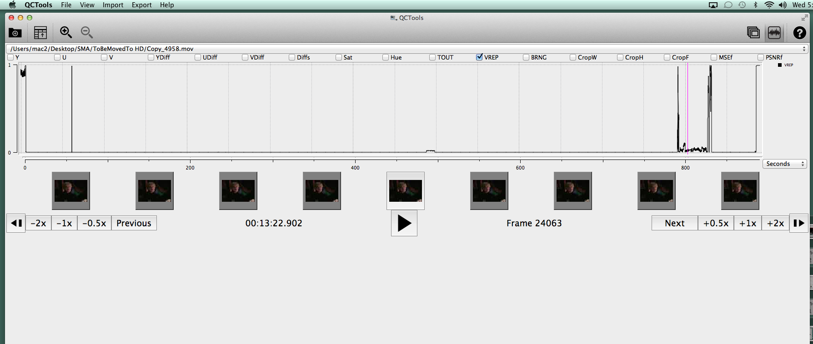

**Samples which demonstrate Vertical Repetition anomalies: **

******8. Peak Signal to Noise Ratio
(PSNRf) **

  **Graph Domain **            **Graph Name(s) **   **Value**   **Ideal Range**
  ---------------------------- -------------------- ----------- -----------------
  Peak Signal to Noise Raito   PSNRf                0-60 dB     30-50 dB

This graph plots the Peak Signal to Noise Ratio between the video in
Field 1 (odd lines) versus the video in Field 2 (even lines). PSNR is
most commonly used to measure the quality of reconstruction of lossy
compression codecs (e.g., for image compression). The signal in this
case is the original data, and the noise is the error introduced by
compression. When comparing compression codecs, PSNR is an
*approximation* to human perception of reconstruction quality. Although
a higher PSNR generally indicates that the reconstruction is of higher
quality, in some cases it may not. One has to be extremely careful with
the range of validity of this metric; it is only conclusively valid when
it is used to compare results from the same codec (or codec type) and
same content.

Typical values for the PSNR in lossy image and video compression are
between 30 and 50 dB, provided the bit depth is 8 bits, where higher is
better. Lower values indicate that Field 1 and Field 2 are becoming more
different which would happen during a playback error (ex. head clog).

**Sample of Ideal Range:**

**Samples which demonstrate Peak Signal to Noise Ratio anomalies:**

**9. Mean Square Error (MSEf) **

  **Graph Domain **   **Graph Name(s) **   **Range **   **Ideal Range**
  ------------------- -------------------- ------------ ---------------------------
  Mean Square Error   MSEf                 0-1          As close to 0 as possible

This graph is meant to be used in the definition of the PSNR values. It
reports on the Mean Square Error between Field 1 and Field 2. This is
then used to calculate the PSNR. Higher values may be indicative of
differences between the images of Field 1 and Field 2. In simpler terms,
just want to make sure that this graph stays low and constant (as close
to 0 as possible with few deviations) and that the PSNR stays between
30-50 dB. These two graphs are best used alongside others as
supplementary information.

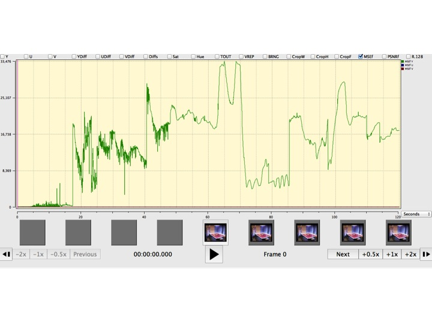
**Samples which demonstrate Mean Square
Error anomalies: **

****

****

 **Playback Filter Descriptions **

The QCTools preview window is intended as an analytical playback
environment that allows the user to review video through multiple
filters simultaneously. Often inconsistencies within the graph layout
may be better understood by examining those frames in the playback
window. The playback window includes two viewing windows which may be
set to different combinations of filters. This allows a user to playback
a video by multiple forms of analysis simultaneously just as viewing a
Waveform and a Vectorscope side-by-side or seeing the video with
highlighted pixels that are outside of broadcast range while seeing the
waveform display.

**Field View**: Many of the filters include the option of enabling
**Field.** This display splits the two video Fields for the selected
frame and shows them as separate images. Thus all odd-numbered video
lines present appear on the top of the image and the even-numbered lines
appear on the bottom (see right hand side of image below). To enable
Field, click the checkbox next to the filter drop-down menu (when
available). Older versions of QCTools called referred to this as “Field
Split”.

**1. No Display **

This option enables you to remove one display, thereby only showing one
view. This option allows a single playback window to occupy a greater
amount of screen-space.

**2. Normal **

This view simply shows the video as QCTools interprets it, no special
effects or filtering is added. In this view, you also have the option of
enabling a **Field** display.

**When to Use:** Since many analog video errors occur differently
between the two interlaced Fields, splitting the Fields into two
distinct images can make it easier to see if a given error is caused by
the analog video playback device (such as a head clog where the two
Fields would react very differently) or tape damage (where the two
Fields would react similarly).

**What to Look For: **

****

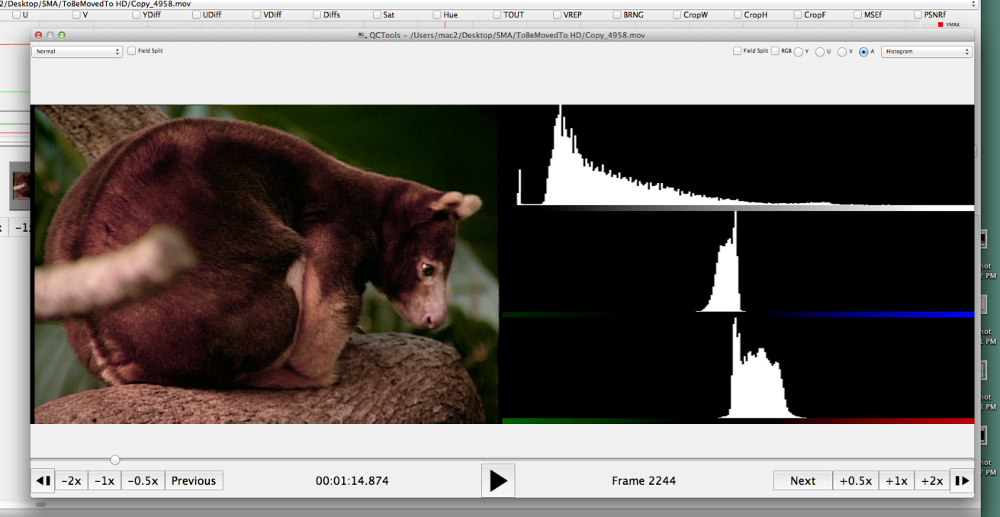
**3. Histogram **

The histogram charts the exposure and brightness of the video image.
When you select this filter, check the RGB box. Typically the histogram
will show one graph per channel (one for each Y, U, and V or one for
each red, green, and blue). You can look at all 3 at once (check A box)
or each individually. You may also select **Field** option which will
depict Fields 1 and 2 separately (Field 1 on top, Field 2 on bottom).

The graphs all show the levels of each channel from lightest to darkest.
This means that the height of the plots on the left correspond to the
dark parts of the image in that channel and the right corresponds to the
lighter parts of the image. Video with a lot of contrast and a well
distributed range of luminance values will result in a histogram with an
even spread. The height or number of peaks and valley is not important.
You want to make sure that the plots extend fully between the left and
right. If the ends of the plots are bunched up and climbing against the
end of the graph display, this most likely means that your image is
overly bright and clipping has occurred.

**4. Waveform **

The Waveform displays a graph showing the signal intensity in the video
clip. The horizontal axis of the graph corresponds to the video image
(from left to right) and the vertical axis is the signal intensity in
units called IRE (named for the Institute of Radio Engineers). The
numbers on the right vertical axis correspond to the range percentage
(0-100%).

The Waveform displays luminance (Y Channel) information as a waveform.
Bright objects produce a waveform pattern near the top of the graph;
darker objects produce a waveform toward the bottom. For NTSC video in
the United States, luminance levels should range from 7.5 to 100 IRE
(sometimes referred to as the legal broadcast limit).

The waveform monitor is a graphical representation of the image, showing
Luma values in the same position relative to those within the frame. For
example, if part of your sky is overexposed you will see it in the same
horizontal position on the waveform display as it appears in the frame.

Depending on your footage, your waveform will look different. If you are
monitoring video which is high contrast, you might not see any values in
the mid grays. The picture on the left shows a waveform for an evenly
exposed image with a dark patch on the left and brighter values from the
center of the frame out to the right. The trace should not go above 100
or below 0. However, sometimes analog video will have a black border
around the image; it is okay if the border goes below 0%.

**5. Vectorscope **

The Vectorscope displays a circular chart, similar to a color wheel that
shows the video’s chrominance information (U and V Channels).

Saturation is measured from the center of the chart outward. Saturated,
vivid colors produce a pattern some distance from the center of the
chart, while a black-and-white image produces only a dot at the center
of the chart.

The particular color, or hue, of the image determines the direction
(angle of the pattern). Small target boxes \[ \] indicate where fully
saturated magenta, blue, cyan, green, yellow, and red (present in a
color bars test pattern) should appear. In NTSC video, chrominance
levels should not exceed these target areas.

You may also select **Field** option which will depict Fields 1 and 2
separately (Field 1 on top, Field 2 on bottom).

**6. Extract Planes Equalized **

**& Extract Planes UV Equalized**

The **Extract Planes Equalized** filter extracts a specified video plane
(such as Y, U, or V) which represents the Luma or part of the Chroma
data from the video so that it may be reviewed on its own. The filter
also may apply histogram equalization to redistributes the pixel
intensities to equalize their distribution across the intensity range
(this feature can help exaggerate or clarify the details of the plane
image). This filter is useful for detecting lossy compression in video
signals or establishing provenance.

The **Extract Planes UV Equalized** filter is similar to the **Extract
Planes Equalized** filter but shows the two Chroma planes (U and V) side
by side.

****

**7. Bit Plane **

This filter selects the bit position of
each plane for display. Selecting 'None' for a plane will replace all
values with 0x80 (middle gray for Y and no color for U or V). Selecting
'All' will send the display plane as is. Selecting 'Bit \[1-8\]' will
display only that specific bit position of each pixel of the plane. For
the Y plane a pixel will display as black if that bit is '0' or white if
that bit is '1'. For U a pixel will be yellow-green if '0' purple if
'1'. For V a pixel will be green for '0' and red for '1'. Generally
lossy video codecs will show blocky structured patterns at higher
numbered bit positions. (Video sample and permission to use provided by
[*seattle.gov*](http://www.seattle.gov))

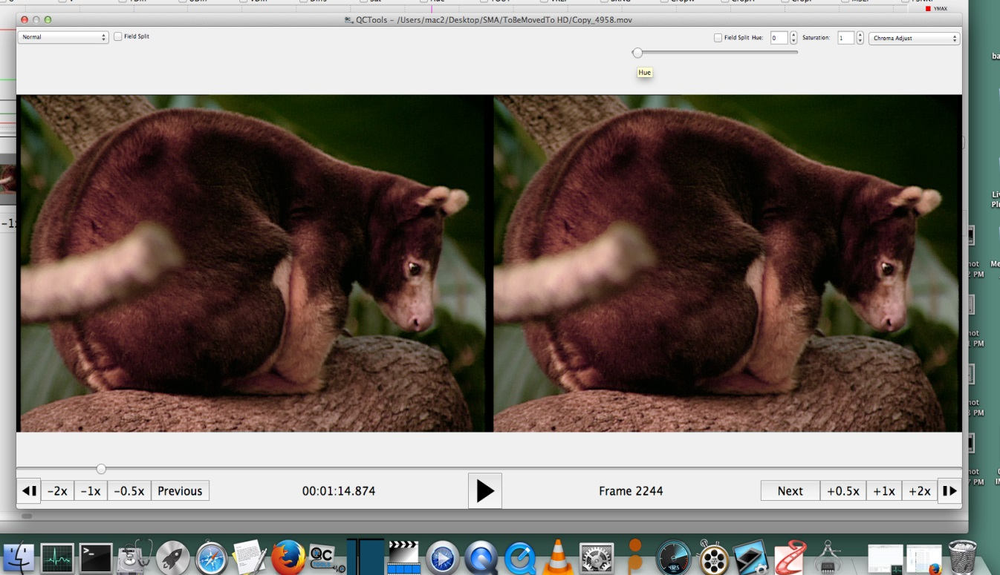
**8. Chroma Adjust **

This filter enables the Hue and Saturation levels to be adjusted. Hue
adjustments may be expressed in degrees where 0 is no change and 180
would invert the color. For Saturation a value of 1 leaves the
Saturation unchanged, 0 removes all color, and the Saturation may be
increased up to a maximum of 10.

**9. Field Difference **

This presentation visualizes the difference between video Field 1 and
Field 2. A middle gray image would mean that Field 1 and Field 2 were
identical, whereas deviation to white or black indicates a difference.

**12. Broadcast Range Pixels **

This is the same presentation as 'Normal' except that pixels that are
outside of broadcast range are highlighted as white. This can often
correspond to Luma noise. Again here, you have the option of selecting
**Field** to display Field 1 (top) and Field 2 (bottom) separately.

**13. Broadcast Illegal Focus **

For video that uses the YUV colorspace and decode in a broadcast range.
Values from 0-16 (on an 8 bit scale) will all decode to black on a
computer monitor, while values from 235-255 will decode as white. This
filter allows the users to select to feature pixel data that is outside
of broadcast range. Select "above whites" to set pixels with Luma values
from 236-255 to a range of grays (while all other pixels are set to
black). Select "below black" to set pixels with Luma values from 0-15 to
a range of grays (while all other pixels are set to black). If a video
frame only contains pixels that have Luma values within broadcast range,
then this filter will play black only black pixels. This filter portrays
broadcast range compliance in somewhat the opposite way as the
"Broadcast Range Pixels" filter since it focuses on values that may be
crushed to black or white because they fall outside of broadcast range.
Note that some videos may intentionally be encoded in 'full range' where
this filter is less relevant.

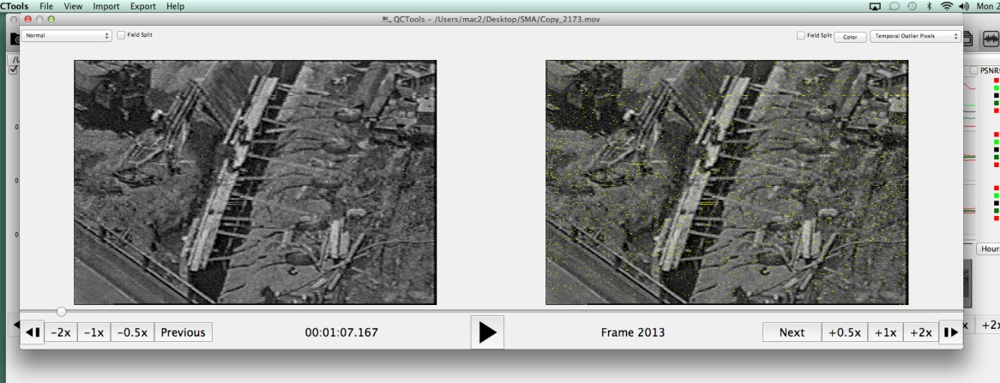
**14. Temporal Outlier Pixels **

This filter was created to detect white speckle noise in analog VHS and
8mm video. This is the same presentation as 'Normal' except that pixels
that are labelled as temporal outliers are highlighted as white.
Temporal outliers are pixels that significantly differ from their
neighbors and often correspond to tape damage or playback error. When
used in conjunction with the Broadcast filters above, you can determine
whether the white noise in your video is caused by tape damage or Luma
levels. Select **Field** to see the Fields displayed separately.

For more information on TOUT graphs and playback filters, consult the
BAVC blog post **QCSchool: All About TOUT**.

****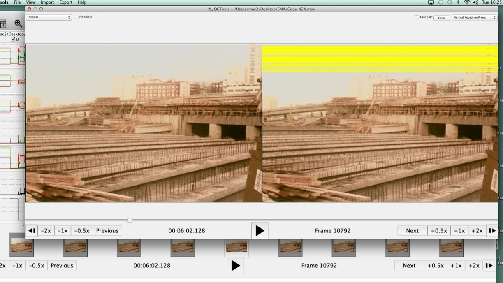
**15. Vertical Line Repetitions **

This filter displays repetitive lines of video data. This information is
useful in analyzing U-Matic tapes and detecting artifacts generated in
the course of the digitization process or through tape damage. For
example, in the image below, on the left, you can see that the lines of
distortion running across the image correspond to horizontal yellow
bands across the image on the right. This indicates that the tape is
damaged or the player is dirty. It helps to run this filter over any
video that you think looks off to immediately rule out tape/player
issues.

**Artifacts**

**Vocabulary**

**Artifact** is being used in the context of this manual to describe
anything problematic which may occurring during playback or capture
which compromises the quality of the video image or sound. BAVC defines
artifact as, “an undesirable picture element in a video image, which may
naturally occur in the recording process and must be eliminated in order
to achieve a high quality image. Most common artifacts are cross-color
and cross-luminance. Not to be confused with artifact as a cultural
product*”* (Bay Area Video Coalition, 1998).

**Error** refers to the underlying cause of the poor quality.

**Area** refers to the physical location where the error can be
resolved.

**INTRODUCTION**

As described in the A/V Artifact Atlas:

> For original archival audio or video materials, the recorded signal
> must be reformatted in order to remain accessible. During the playback
> and reformatting process, how can we determine if an error we see or
> hear is inherent to the original recording, or was the result of an
> imperfect transfer? How can we tell if it is a sign of equipment
> malfunction or media damage? How do we know if it can be remedied?
>
> Identification and definition of audio-visual artifacts is a critical
> part of archival work. Any number of errors in the signal encoding, or
> re-encoding, can occur at any point in the life cycle. Sometimes the
> error is introduced at the time that the recording is originally
> created, perhaps by either low-quality, improperly-configured or
> poorly-functioning equipment or by ambient conditions that interfere
> with the recording process. In some cases the error appears as the
> original recording is being reformatted, caused by damage or media
> deterioration that has occurred to the original media over time, or by
> poorly-functioning equipment used in the reformatting process. At any
> time, operator error can result in unintentional mistakes that reduce
> the quality of the transfer (A/V Artifact Atlas, 23 February 2015).

**Categorization**: The categories used in this manual are meant to make
solving a problem more efficient and intuitive. They refer to the
physical location where adjustments may be made to improve the video
quality. Without this direction, guess work can lead to additional
errors if multiple adjustments are made in several areas. Below is a
list of artifacts that may occur during digitizing. They are broken down
into categories based upon area:

> 1\. **TBC Errors:** The levels on the TBC are out of ideal range and
> require adjustment to fit the needs of the tape.
>
> 2\. **Mechanical Errors:** There is something wrong with the player and
> its interaction with the tape; cleaning or adjustment of the player is
> required.
>
> 3\. **Tape Damage:** The tape is damaged from wear/age/use etc.

Within each of these areas, several common errors may occur during
processing creating the artifact. The following list outlines the way
the rest of this manual is organized to help you identify and fix the
errors you may encounter. Each error is broken down to explain what you
will see and what it means. Step-by-step instructions are provided where
possible to assist you in identifying, confirming and, if possible,
solving specific errors. With older, deteriorating tapes, some problems
may occur which are unavoidable. The graphs and playback filters will
help you to determine whether or not this is the case.

> **TBC Errors**

1.  High Video Level

2.  Undersaturation

3.  Oversaturation

4.  Chrominance Noise

5.  Luminance Noise

6.  Hue

7.  Y/C Delay Error

8.  TBC Processing Artifact

> **Mechanical errors **

1.  Tracking Error

2.  Skew Error

3.  Video Head Clog

4.  Head Switching Noise

5.  Timecode Error

> **Tape Damage**

1.  Dropout

2.  Tape Crease

**Alternative Categories:** The **A/V Artifact Atlas** organizes errors
within their index in a slightly different manner. The error categories
are defined by the root of the problem: **Device** **Error**,
**Operator** **Error**, **Production** **Error**, and **Tape**
**Error**. While these categories are scientifically accurate and
incredibly helpful if you are familiar with video terms, the gray areas
between them can be a bit overwhelming. The categories in this manual
are tailored to apply to your institution’s needs and digitizing
workstation.

**Production Error** is the only category without an equivalent in this
manual. The majority of production errors require initial trouble
shooting to determine whether or not production is actually the cause.
By weeding out an alternative error (device, operator, or tape), a
production error will become apparent. In cases where it is impossible
to remove an artifact from the video image, it is most likely caused by
age or production. It is very difficult to know for certain whether or
not the artifact was created in production or through other means, so
trying your best to fix it and then moving on is the most efficient and
functional work plan. For any case where a production error may be
present, the possibility has been noted.

Please note there are many more errors that can compromise video quality
than are described here. For more information, visit the **A/V Artifact
Atlas**
(http://avaa.bavc.org/artifactatlas/index.php/A/V\_Artifact\_Atlas).

**TBC Problems**

The bullet points under each item are formatted to explain how to spot
this error during play back, how to confirm this using QCTools, know
whether or not it can be solved by adjustments/re-digitizing and, if so,
how to solve it.

1.  **High Video Level**

2.  **Undersaturation**

3.  **Oversaturation **

4.  **Chrominance Noise**

5.  **Luminance Noise**

6.  **Hue**

7.  **Y/C Delay Error**

8.  **TBC Processing Artifact**

**1. High Video Level (Video Gain Error)**

**What You See During Playback –** Areas with a lot of light or white
(notice the sky and the shirt in the image below) will appear washed out
or overly bright and detail will be lost.

When a video signal is recorded, peak white levels can usually be
adjusted in a camera, a playback VTR or a number of intervening
processing amplifiers. In some cases, natural tips of the video level
can be overdriven by miscalibration and become clipped at the top of the
video signal. Particularly bright scenes might have natural peaks above
100 IRE in raw camera footage, but clipped video signals above that
range may mean detail in the video image is being lost during
digitization. Video levels that are too high can also introduce noise
into the image that is not in the original source.

> 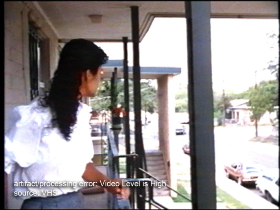
}
> 
}
>
> *Before* *After*

**What You See on BlackMagic Design** – Check the Luma and Black
activity by looking at the Waveform monitor on the BlackMagic Design
display. If the waves are consistently above the **100-110** mark and
crushed/flat, this could indicate that the video signals are out of
range.

*Before* *After*

**How to Check in QCTools (Graph) -** To confirm that this is the cause
of the problem, run through QCTools. Click on the check box to display
the **Y graph**. Locate the point in the recording containing the
artifact by using the time signature guides on the bottom. Note the IRE
levels of the **Y AVG** (average) line within the **Y graph** by using
the guides on the left side of the graph. The lines should be around
**128**. If there are dramatic peaks in the graph above 110 that last
for more than a few frames, high video level is most likely the cause.
Occasional peaks can be created by a brief burst of light or a white
fade-out.

**How to Check in QCTools (Filter) –** Double click on the thumbnail (at
the bottom of the QCTools window) that corresponds to the problematic
area. The **Video Analysis Window** will pop-up. On the right side,
select the **TOUT** filter and note the amount of pixels that are
highlighted in yellow (out of range). Often, they will be highlighting
or outlining areas of the image that are too bright.

**Can You Fix It?** – Yes, this is correctable through retransfer and
adjustment of the VTR output using a processing amplifier to adjust
video levels.

**How to Fix It** – The following steps will allow you to adjust the
video level and troubleshoot fixing the image quality:

-   Start playback in Black Magic and begin capturing.

-   On the TBC that corresponds with the Mac you are using, check that
    the display panel is in showing the idle screen (displaying the Y,
    C, and R bars).

-   Click **Enter** to access the **Main** menu.

-   Click **Enter** to select the **Video Setup** menu.

-   Click **Enter** to select **Video Gain**. Once this control opens,
    it will display a bar range with 0 at the middle. This is usually
    the current/automatic setting, unless someone had adjusted it prior
    to your digitization. If the display does not open at 0, the cause
    could be that previous adjustments do not work with your
    current tape. Set the video gain back to 0 and see if that resolves
    the problem. If the display opens at 0, then make adjustments while
    viewing the playback to see if this fixes the image. Note the level
    of the video gain. If changes do occur, end the capture and run it
    through QCTools (same graphs and filters).

-   Note the changes in the graph as the adjustments occurred. If they
    are still out of range, notice the amount of the video gain
    adjustment (TBC display) vs. the changes in the graph. Using this
    rough estimation, try the quick capture again, making adjustments to
    try to reach ideal range. Do this as many times as necessary to
    achieve the best image quality possible.

-   Make sure all the other levels are still ideal and digitize
    the tape.

\
**2. UnderSaturation**

**What Do You See During Playback –** The video signal is undersaturated
when chrominance amplitude is restricted to values under reference
standard level (i.e., 75% SMPTE color bars), causing colors to appear
washed out and unnaturally pale. Undersaturation can be difficult to
identify because video is sometimes intentionally given a desaturated
"look" during post-production treatment or finishing. However, raw
camera footage should always be appropriately saturated and calibrated
to reference color bars, if available, unless otherwise stated in
production notes.

**NOTE:** If the video was previously transferred from film, color fade
from the original film may be present. A fading of the cyan and yellow
dyes resulting in an oversaturation of magenta is the most common
manifestation of this problem.

*Before* *After*

**First Check –** Before making adjustments, check to make sure this is
not a Field error (see **Mechanical Problems, 3. Video Head Clog,
Additional**)

**How to Check in QCTools (Graph) –** Select the **Sat** and **Hue. Hue
AVG** should be *at* **147** and **Sat** should be *at or below*
**88.7** and *above* **0**. Select the **V** and **U** graphs. The lines
should all be relatively smooth (straight/flat) and should be between
**0-88.7**. Undersaturated images will be way below 88.7. The Hue may
also be too high or low (above or below 147).

**Can You Fix It? –** Yes, this is correctable through adjustment of the
**Chroma** and **Hue** levels.

**How to Fix It** – The following steps will allow you to adjust the
video level and troubleshoot fixing the image quality:

-   Start playback in Black Magic and begin capturing.

-   Click **Chroma** on the TBC. Once this control opens, it will
    display a bar range with the IRE enlarged.

-   While watching the **Vectorscope** on the **BlackMagic Design**
    display, slowly rotate the **dial** on the TBC to the right
    to increase.

-   Note the level of Chroma gain. If changes do occur, end the capture
    and run it through QCTools

-   Note the changes in the graph as the adjustments occurred. If they
    are still out of range, notice the amount of the Chroma adjustment
    (TBC display) vs. the changes in the graph. Using this rough
    estimation, try the quick capture again, making adjustments to try
    to reach ideal range. Do this as many times as necessary to achieve
    the best image quality possible.

-   If the **Hue AVG** was not at 147, it also needs to be adjusted.
    Click **Hue** on the TBC. Once this control opens, it will display a
    bar range with the IRE enlarged.

-   While watching the **Vectorscope** on the **BlackMagic Design**
    display, slowly rotate the **dial** on the TBC to the right to
    increase or left to decrease (depend on what its previous graph
    reading was).

-   Note the level of Hue gain on the TBC display. If changes do occur,
    end the capture and run it through QCTools

-   Note the changes in the graph as the adjustments occurred. If the
    end results are still out of range, notice the amount of the Hue
    adjustment (TBC display) vs. the changes in the graph. Using this
    rough estimation, try the quick capture again, making adjustments to
    try to reach ideal range. Do this as many times as necessary to
    achieve the best image quality possible.

-   Make sure all the other levels are still ideal and digitize
    the tape.

****

**3. OverSaturation (Chroma Error)**

**What Do You See During Playback –** Oversaturation refers to high
chrominance amplitude in a video signal, creating the appearance of very
intense color in the image. Depending on severity of oversaturation,
color in the image may appear to bleed into areas outside of an object’s
apparent boundaries. Most NTSC broadcast standards require that the
composite video signal not exceed 120 IRE (flat). SMPTE split Field
color bars use 75% Saturation as the maximum value for calibration,
although there are other patterns used for testing which contain 100%
Saturation values.

*Before* *After*

**What You See on BlackMagic Design –** the trace within the Vectorscope
will be extending beyond the color markers (the small squares by the
letters).

**How to Check in QCTools (Graph) –** Select the **Sat** and **Hue. Hue
AVG** should be *at* **147** and **Sat** should be at or *below*
**88.7**. Select the **V** and **U** graphs. The lines should all be
relatively smooth (straight/flat) and should be between **100**-
**120**. Oversaturated images will be way above 120. The Hue may also be
too high or low.

**Can You Fix It? –** Yes, oversaturation is correctable through
retransfer and adjustment of the VTR output using the TBC controls.

**How to Fix It** – The following steps will allow you to adjust the
video level and troubleshoot fixing the image quality:

-   Start playback in **Black Magic Media Express** and begin capturing.

-   Click **Chroma** on the TBC. Once this control opens, it will
    display a bar range with the IRE enlarged.

-   While watching the **Vectorscope** on the **BlackMagic Design
    display**, slowly rotate the dial on the TBC to the left to lower.

-   Note the level of **Chroma** gain. If changes do occur, end the
    capture and run it through QCTools

-   Note the changes in the graph as the adjustments occurred. If they
    are still out of range, notice the amount of the **Chroma**
    adjustment (TBC display) vs. the changes in the graph. Using this
    rough estimation, try the quick capture again, making adjustments to
    try to reach ideal range. Do this as many times as necessary to
    achieve the best image quality possible.

-   If the **Hue AVG** was not at 147, it also needs to be adjusted.
    Click **Hue** on the TBC. Once this control opens, it will display a
    bar range with the IRE enlarged.

-   While watching the **Vectorscope** on the **BlackMagic Design**
    display, slowly rotate the **dial** on the TBC to the right to
    increase or left to decrease (depend on what its previous graph
    reading was).

-   Note the level of Hue gain on the TBC display. If changes do occur,
    end the capture and run it through QCTools

-   Note the changes in the graph as the adjustments occurred. If the
    end results are still out of range, notice the amount of the Hue
    adjustment (TBC display) vs. the changes in the graph. Using this
    rough estimation, try the quick capture again, making adjustments to
    try to reach ideal range. Do this as many times as necessary to
    achieve the best image quality possible.

-   Make sure all the other levels are still ideal and digitize
    the tape.

****

**4. Chrominance Noise**

**What Do You See During Playback – Chrominance noise** can be
identified as traces and specks of color in an otherwise clear picture.
It is most visible in dark, saturated areas of the video image. It can
be due to limitations of CCD sensitivity in video cameras (i.e.,
low-lighting conditions during camera recording), over-boosting of
chrominance in the video signal, or the use of poor video processors.
Multi-generation composite dubs may suffer from high levels of
chrominance noise.

**What You See on BlackMagic Design –** On the Vectorscope, the specks
of trace with appear to bounce or reverberate outward from the
concentration of trace at the center. This movement is similar that of
ripples, but happen in odd bursts, There may also be a constant presence
of speckled trace that extend out much further than the concentration of
trace pattern.

**How to Check in QCTools (Graph) –** Select the **U** and **V** graphs.
Look for any areas with abrupt spikes or plummets (particularly in the
MIN and MAX).

**How to Check in QCTools (Filter) –** double-click a frame with Chroma
noise (corresponding to the same time signature as a spike in the graph)
and select the **Histogram** filter in the right hand view. Check the
**U** and **V** boxes to view just these two graphs. If the plots are
climb the edges of the display or do not extend to both edges, the
Chroma levels are most likely off.

**Can You Fix It? –** Maybe**.** If the video output has been properly
adjusted for playback, there is not an acceptable fix for this problem
in preservation workflows.

**How to Fix It –** If the Chroma levels (U and V) were off, you can try
the following steps to reduce the noise:

-   Start playback in **BlackMagic Media Express** and begin capturing.

-   Click **Chroma** on the TBC. Once this control opens, it will
    display a bar range with the IRE enlarged.

-   While watching the **Vectorscope** on the **BlackMagic Design**
    display, slowly rotate the dial on the TBC to the left to lower.

-   Note the level of **Chroma** gain. If changes do occur, end the
    capture and run it through QCTools

-   Note the changes in the graph as the adjustments occurred. If they
    are still out of range, notice the amount of the **Chroma**
    adjustment (TBC display) vs. the changes in the graph. Using this
    rough estimation, try the quick capture again, making adjustments to
    try to reach ideal range. Do this as many times as necessary to
    achieve the best image quality possible.

****

**5. Luminance Noise **

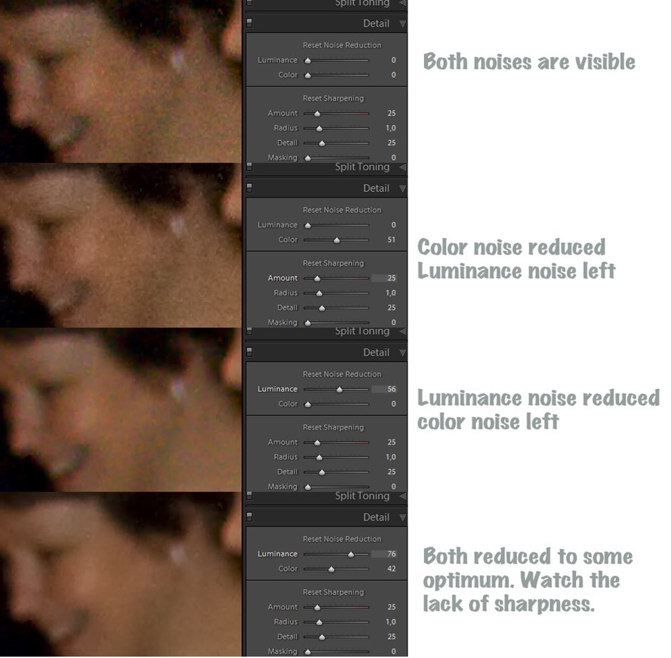
**What Do You See During Playback –** Luminance noise
is noise where only the brightness of a colored pixels is affected (but
the color as such is fine). This appears as a bright layer of white
noise (a translucent layer of snow) over the image.

**What You See on BlackMagic Design –** The **Waveform** monitor will
show an uneven trace spread, with trace that is consistently out of
ideal range.

**How to Check in QCTools (Graph) –** On the **Y graph**, look for any
plots that are not within the 16-235 range or where the peaks and valley
are noticeably erratic. On the **YUV Diffs graph**, see if there is a
significant different between the Y plot and the U/V plots. Also, look
at the **Broadcast Range graph**; normal, noise-free video would not
trigger this filer, but noise occurring outside of these parameters
would read as spikes in the graph. Typically anything with a value over
0.01 will read as an artifact.

**How to Check in QCTools (Filter) –** Double click on a frame that
contains Luma noise. On the right hand view, compare the **Broadcast
Range Pixels filter** with the **TOUT filter**. Both will possibly
present spots (specks) highlighted in yellow. Notice the spread of the
yellow specks in both. Do they outline areas that are either white or
black? Or are they evenly spread across the image? If the spread is
even, the noise is probably caused by tape damage. If it is concentrated
in certain areas, this is most likely a Luma level artifact that is can
be fixed through adjustment or was recorded into the original image.

**Can You Fix It? –**Maybe. If the video output has been properly
adjusted for playback, there is not an acceptable fix for this problem
in preservation workflows.

**How to Fix It –** If the Luma levels (Y) were off, you can try the
following steps to reduce the noise:

-   Start playback in **BlackMagic Media Express** and begin capturing.

-   Click **Luma** on the TBC. Once this control opens, it will display
    a bar range with the IRE enlarged.

-   While watching the **Vectorscope** on the **BlackMagic Design**
    display, slowly rotate the dial on the TBC to the left to lower.

-   Note the level of **Luma** gain. If changes do occur, end the
    capture and run it through QCTools

-   Note the changes in the graph as the adjustments occurred. If they
    are still out of range, notice the amount of the **Luma** adjustment
    (TBC display) vs. the changes in the graph. Using this rough
    estimation, try the quick capture again, making adjustments to try
    to reach ideal range. Do this as many times as necessary to achieve
    the best image quality possible.

****

**6. Hue**

**What Do You See During Playback –** The colors will immediately appear
**“**off” and most noticeably, the majority of featured skin tones will
look unnatural (too orange, red, yellow, etc.)

**What You See on BlackMagic/Vrecord Design –** on the **Vectorscope**
the concentration of trace will not point exactly at the 147⁰ point
(skintone line marked on Vrecord vectorscope) and the color
concentration will be significantly uneven. The Hue measurement on the
Vrecord numerical display will be significantly above or below 147⁰.

***Please note:*** Hue can be *very* tricky. The numbers above for the
suggested range are based on an image that is mostly of a person’s
face/skin (all/any skin colors). Having other objects in a variety of
colors will affect the reading. For example, if a person is wearing red,
the hue average will be much higher (closer to 147⁰-150⁰) or if he/she
is standing next to a bunch of trees on a bright day, the hue average
will be much lower (closer to 110⁰-125⁰). Both of these colors can
reflect onto the person’s and cause his/her skin to appear pink or
yellow/green, even when the hue is in balance. This is most problematic
with Umatic video.

**How to Check in QCTools (Graph) –** The Hue measurement on the will be
significantly above or below 147⁰.

**How to Check in QCTools (Filter) –** Hue, Saturation, Diffs, & U/V

**Can You Fix It? –** Yes (most likely)

**How to Fix It –** Using the TBC that corresponds with the Mac you are
using, do the following:

-   Push the **Hue** button

-   Using the **dial**, adjust the range to be **147⁰**. Adjusting the
    **Hue** on the **TBC** will rotate the angle of the pattern (trace)
    on the **Vectorscope**.

-   Check your work by watching the **Vectorscope** monitor on the
    **BlackMagic Design** display. The angle of Hue should be about
    **123-147⁰** or about **11 o’clock**. In **Vrecord**, the program
    window **Vectorscope** has markers for the **skintone** line

-   For more information read the **Vectorscope** section in the **Video
    Processing Manual**.

****

**7. Y/C Delay Error**

**What Do You See During Playback –** When video suffers from Y/C delay
error, there will be a mismatch in the timing among the luminance and/or
color channels, with resulting visible misalignment in how colors appear
in the monitor. A misalignment of Y/C shows a blurry edge around areas
with high contrast color difference, and will be most apparent around
sharp edges of objects in the video image. Notice the difference in the
images below highlighted in the enlarged detail boxes. In the *Before*
(image on the left) you can see a white edge along the reporter's yellow
jeans, as well as a green hue around the orange drop shadow in the
lettering on the sign behind them. This is caused by misaligned Y and C
components in the video signal. The error is corrected in the *After*
image (image on the right).

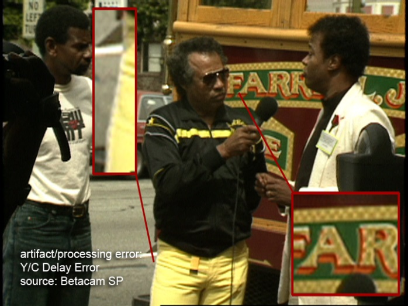

*Before* *After*

**What You See on BlackMagic Design –**

**How to Check in QCTools (Filter) – **

**Can You Fix It? –** Yes, some time base correctors (VTR integrated or
stand-alone) have Y/C adjustment capability.

**How to Fix It** – The following steps will allow you to adjust the
video level and troubleshoot fixing the image quality:

-   Start playback in Black Magic and begin capturing.

-   On the TBC that corresponds with the Mac you are using, check that
    the display panel is in showing the idle screen (displaying the Y,
    C, and R bars).

-   Click **Enter** to access the **Main** menu.

-   Click **Enter** to select the **Video Setup** menu. Use the knob to
    scroll through the list of options.

-   Click **Enter** to select **Input** **Y/C Delay**. Once this control
    opens, it will display a bar range. Make adjustments while viewing
    the playback to see if this fixes the image. Note the level of the
    video gain. If changes do occur, end the capture and run it through
    QCTools (same graphs and filters).

-   Note the changes in the graph as the adjustments occurred. If they
    are still out of range, notice the amount of the input Y/C delay
    adjustment (TBC display) vs. the changes in the graph. Using this
    rough estimation, try the quick capture again, making adjustments to
    try to reach ideal range. Do this as many times as necessary to
    achieve the best image quality possible.

-   Make sure all the other levels are still ideal and digitize
    the tape.

**8. TBC Processing Artifact**

**What Do You See During Playback –** An artifact which is generated by
maladjustment or circuitry failure in an integrated or stand-alone time
base corrector (TBC) can be categorized as a processing artifact.
Depending on the type of TBC used, these have a diverse set of
manifestations and can include over-enhancement and aggressive noise
reduction. If a video signal output to a time base corrector is suddenly
lost due to low RF from severe media damage, a head clog or some other
incident, the TBC may output noise while the processor attempts to
re-lock to the incoming video signal.

In the example below, a TBC was introducing errors through
overcorrection. The image on the left is the correct image processed
through a properly functioning TBC, while the image on the right shows
overcorrection for what would otherwise be minimal skewing at the top,
and a line error now appearing along the bottom. During playback, this
tape showed a vertically shaky display that wasn't occurring before the
signal was sent through the TBC.

*Correct Incorrect*

**What You See on BlackMagic Design –**

**How to Check in QCTools (Graph) –**

**How to Check in QCTools (Filter) – **

**Can You Fix It? –** This artifact may be correctable by readjustment
or calibration of the TBC. If the TBC cannot process video output due to
poor playback signal from the VTR, the media must be treated to improve
playback or a different and more effective TBC must be used.

**How to Fix It –**

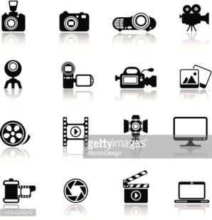
**Mechanical Problems**

The bullet points under each item are formatted to explain how to spot
this error during play back, how to confirm this using QCTools, know
whether or not it can be solved by adjustments/re-digitizing and, if so,
how to solve it.

1.  **Tracking Error**

2.  **Skew Error**

3.  **Video Head Clog**

4.  **Head Switching Noise**

5.  **Timecode Error**

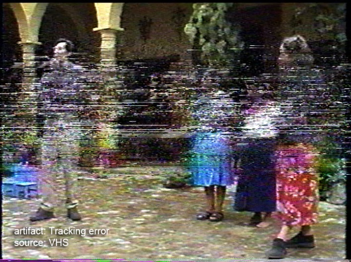
**1. Tracking Error**

**What Do You See During Playback –** Tracking error is visible as a
distortion produced during playback caused by the inability of video
heads to correctly follow the video tracks recorded on a tape. The
tracking control adjustment corrects for this error. It delays the
control track signal during playback so its position approximates the
position of the control track head that was used on the recording
machine.

**What You See on BlackMagic Design –** See **Waveform** filter (same as
BlackMagic Design display) below.

**How to Check in QCTools (Graph) –** Large tracking errors in a video
file will be clearly evident as significant spikes in the Temporal
Outliers (TOUT) graph. Check the boxes to generate graphs for both
**TOUT** and **VREP**. Examples of TOUT graph and playback images with
tracking errors below.

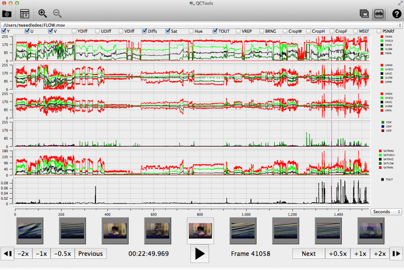
**How to Check in QCTools (Filter) –**
Double click on the thumbnail (at the bottom of the QCTools window) that
corresponds to the problematic area. The **Video Analysis Window** will
pop-up. On the right side, select the **Temporal Outlier Pixels**
filter. This is the same presentation as **Normal** except that pixels
that are labelled as temporal outliers are highlighted in yellow.
Temporal outliers are pixels that significantly differ from their
neighbors and often correspond to tape damage or playback error. A
certain level of this is so be expected, especially on older tapes, but
the lines of the **TOUT** graph should remain between 0-0.009 and be
closer to 0 for the majority of the playback.

The yellow highlighted pixels should also be evenly scattered and not
too concentrated in one or more spot (see example above). Note any
significant increases in the pixels, corresponding to the distortion on
the **Normal** playback and spikes in the **TOUT** graph (see image
below).

In the above image, the pixels are concentrated in places where the
white or black levels are out of range (overly dark or overly
bright/white). This would signify a TBC adjustment error, whereas the
first image implies either damage to the tape or a tracking error. Also,
often times with a tracking error, if you leave the Temporal Outlier
Pixels filter up during playback, the yellow areas with move change
significantly and quickly.

Next, select the **Vertical Line Repetitions** filter. This will help to
separate damage or tracking errors from color errors.

**Can You Fix It? –** Yes, a tracking error can be corrected by careful
tracking adjustment. Severe tracking errors with a particular piece of
media may require a custom tape path alignment.

**How to Fix It –** On the front of the **U-matic** player, just to the
right of the **Audio Level** knobs, is the **Tracking** knob. While in
playback mode, slowly twist the knob back and forth and notice if the
problem increases or decreases. Make sure to try going all the way to
the left and to the right, as well as going very slowly to see if, at
any point the distortion dissipates. If not, this may be a tracking
error that would require a custom tape path alignment or might imply
damage to the tape.

****

**2. Skew Error**

**What Do You See During Playback –** Tape
is susceptible to expansion and shrinkage, see Lengthwise Tape Expansion
or Shrinkage These dimensional changes impact the length and angle of
the recorded tracks. On playback, the loss of correspondence between the
track position and the playback head results in a skewed picture. "A
skew error shows as a hooking in the picture at the top \[or bottom\] of
the TV monitor. If the picture hooks to the left, the video track on the
tape is longer than the playback track length of the machine. If the
picture hooks to the right, the video track on the tape is shorter than
the playback length of the machine". Audio may also be affected. "Even
if there is no actual image error, it is possible to see, at the bottom
of the uncropped image (i.e. in underscan mode), a slight, jittery line
displacement immediately below the head switching point. If the symptom
is very pronounced, the skewing will also appear along the top edge of
the image, where it becomes visible as a disruptive skew error."

**Can You Fix It? –** Maybe**.** Some VTRs have skew controls that allow
for minor adjustments in tape tension, most notably, several models of
U-matic machines and some 1/2" open reel models. Otherwise, skew error
may be minimized through the use of a good time base corrector (TBC). It
may also require an alignment adjustment or back tension adjustment in
the player equipment, but be careful: this kind of tinkering should be
done by a trained technician and not performed on equipment used for
recording.

**How to Fix It –** The **U-matic** players have a horizontal **Skew**
switch to the right of the analog time counter. While the video is in
playback, slowly move the switch from side to side and notice if the
edges of the frame bend or straighten. Not all bends can be fixed this
way, but they can be made less noticeable. When bending (or hooking) is
present, this is also the quickest test. As with tracking, you may not
be able to completely fix this error.

****

**3. Video Head Clog**

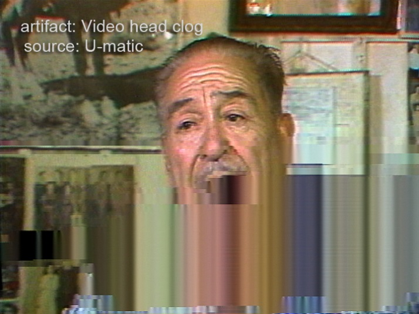
**What Do You See During Playback –** When
loose oxide builds up in the tape path, it can travel with the tape to
the drum assembly and prevent the video head from making contact with
the tape. The result is a heavily obscured image or a complete loss of
image. A video head clog requires thorough cleaning of the video heads
if the clog obstructs RF completely during playback. In most cases, a
severe head clog cannot be removed by playing a cleaning tape through
the VTR. The head and drum assembly must be manually cleaned using a
cleaning solution.

**How to Check in QCTools (Graph) –** Select the **PSNRf** and **MSEf**
graphs (click check box) and the **Diffs** graph. Often, head problems
with corrupted frames will result in large YUV Difference values/graph
spikes. The PSNR graph will be too high and the MSE will be too low.
Both graphs will be uneven.

**How to Check in QCTools (Filter) –** Waveform

**Can You Fix It? –** Yes.

**How to Fix It –** Stop playback and clean the video heads on the
player using an appropriate solvent and cotton swab. While you are at
it, clean the tape path to prevent possible recontamination.

**ADDITIONAL**

**To Rule Out a Head Clog Before Undersaturation** – Double click on the
thumbnail (at the bottom of the QCTools window) that corresponds to the
problematic area. The **Video Analysis Window** will pop-up. On the
right side, select the **Normal** filter for both sides. On either side,
check the **Field** box. This will allow you to make sure that both
Fields are reading the color correctly.

Since many analog video errors occur differently between the two
interlaced Fields, splitting the Fields into two distinct images can
make it easier to see if a given error is from problems with the analog
video playback device (such as a head clog where the two Fields would
react very differently) and tape damage (where the two Fields would
react similarly).

The image below shows two **Normal** displays side-by-side where the
right image has **Field** enabled. By viewed the Fields separated on the
right, it is easily clear that while Field 1 was read correctly from the
tape, there was no color data was read for Field 2.

**Can You Fix It? –** Yes.

**How to Fix It -** This error can be fixed by cleaning the video player
and re-digitizing the content.

**4. Head Switching Noise**

**What Do You See During Playback –** a horizontal line or section along
the bottom of the frame that is consistently out of alignment from the
rest of the picture. This is a result of the video heads being switched
on and off and occurs as a result of the different positions that each
format records information on tape.

> **VHS -** Head switching noise is commonly seen at the bottom of video
> display during VHS playback. Although it occurs in other formats, it
> is often masked depending on the processing features and calibration
> of the playback VTR. During playback of videotape, video heads are
> turned on as they pass over the media and then turned off to prevent
> the display of noise that would be output when they are not in contact
> with the tape. Head switching noise is a result of that switching
> interval, and it occurs prior to the start of vertical sync. This
> artifact is not viewable in overscan on a broadcast monitor, but it is
> viewable in underscan and in full-raster digitized video and
> un-cropped digital derivatives. Some VTRs feature "SWP masking", which
> effectively masks the lines created during head switching with video
> black.

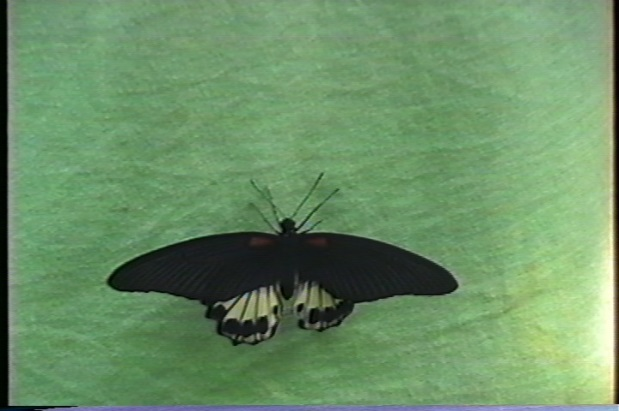

Playback from a normal VHS VCR into a card that captures from line 23,
showing normal switching noise.

Playback from a JVC BR-S525U into a card that captures from line 23,
showing black at the bottom of the image.

Playback from a JVC BR-S525U into a card that captures from line 22,
showing no switching noise. (The bending is because this card has no
TBC.)

> **U-matic -** The VO-series had the head switching point about 3-4
> lines before end of active video, so you can see the head switching
> point at the bottom of the frame. This is also seen in VHS and
> Betamax. This occurs when the tape is recorded, so any tape recorded
> in a VO-series machine will show this problem regardless of what model
> machine you use for playback. The BVU-series machines placed the head
> switching point after the end of active video, so you do not see the
> problem on recordings made on BVU-series machines.

**How to Check in QCTools (Graph) –** TOUT and VREP

**How to Check in QCTools (Filter) –** TOUT and VREP

**Can You Fix It? –** Yes, but only under certain circumstances. It must
not have been recorded as part of the signal on the tape.

**How to Fix It –** Adjust skew and tracking. Since the problem is one
of recording and not playback, not a lot can be done to remove the
artifact, but by making these adjustments, you may be able to minimize
its presence.

> **VHS -** The VHS must be played back on a VCR that advertises
> "switching noise masking". There are only 8 known models that meet
> these criteria; all are very large "Professional" series S-VHS decks
> that are unable to play back tapes recorded in EP or LP modes. These
> are:
>
> JVC BR -S522, -S525, -S822
>
> Panasonic AG -DS545, -DS550, -DS555, -DS840, -DS850
>
> JVC's marketing explains the feature like so: "For improved playback
> and special-effects picture performance, a switching noise masking
> system is also provided. Especially effective with digitally processed
> special-effects pictures, this sets the switching point 1.5H lower
> than normal, completely eliminating on-screen switching noise."
>
> Even with one of these VCRs, capture devices following SMPTE RP 202's
> standard for video alignment will display garbage at the very bottom
> of the image. To obtain a 720x480 image with no switching noise, a
> device that captures starting from line 22 is required. Alternatively,
> one that captures 720x486 can be used, allowing offending image rows
> to simply be cropped off.
>
> **U-matic -** As previously mentioned, this artifact occurs when the
> tape is recorded, so any tape recorded in a VO-series machine will
> show this problem regardless of what model machine you use for
> playback. The skew control can help minimize the horizontal offset at
> the head switching point but it is impossible to completely eliminate
> the picture problem.

****

**5. timecode Error**

**What Do You See During Playback –** Timecode error is visible as a
line or section of rainbow distortion produced along the bottom or top
of the picture.

**Umatic** - The VO-series machines do not properly support timecode.
VO-series machines are not equipped with a timecode head, and do not
contain the necessary filters to remove the unwanted effects where the
timecode track interferes with the video. The addition of a timecode
track on Umatic BVU-series machines was a big compromise. There was no
empty space on the tape where to place the new track. The timecode track
in BVU-series machines was placed an area that can cause “rainbow”
interference at the top or bottom of the frame when played on a
VO-series machine. In some cases it can cause vertical sync instability
because the rainbow interference is obscuring the vertical sync of the
video signal. The BVU-series machines have special filters to eliminate
this interference. You should not see the rainbow interference or
vertical instability on a BVU-series machine. However, a tape recorded
on a BVU-series machine and played on a VO-series machine will likely
show the interference. Furthermore, a tape recorded on a BVU-series
machine and later copied using a VO-series machine will forever have the
interference permanently on the copy.

****

 **Tape Damage**

The bullet points under each item are formatted to explain how to spot
this error during play back, how to confirm this using QCTools, know
whether or not it can be solved by adjustments/re-digitizing and, if so,
how to solve it.

1.  **Dropout**

2.  **Tape Crease**

****

**1. Dropout**

**What Do You See During Playback –**
Brief signal loss caused by a tape head clog, defect in the tape,
debris, or other feature that causes an increase in the head-to-tape
spacing. A dropout can also be caused by missing magnetic material. A
video dropout generally appears as a white spot or streak on the video
monitor. When several video dropouts occur per frame, the TV monitor
will appear snowy. The frequent appearance of dropouts on playback is an
indication that the tape or recorder is contaminated with debris and/or
that the tape binder is deteriorating.

**How to Check in QCTools (Graph) – VREP and TOUT**

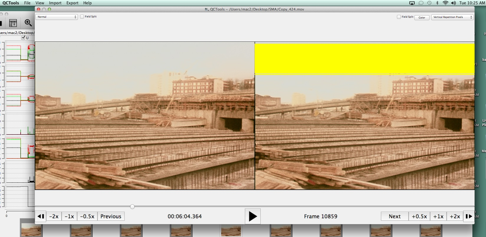
**How to Check in QCTools (Filter) –
VREP**

**Can You Fix It? –**Maybe. If media is scratched so that oxide is
missing, the material cannot be replaced so the dropout is permanent.
Dropout may also be recorded into the original content. This can be
confirmed by "stepping through" the tape in a slow playback mode.

**How to Fix It –** Environmental dirt or loose oxide can be removed by
machine or hand-cleaning. If cleaning, it makes sense to rehouse and/or
clean the cassette shell at the same
time.

**2. Tape Crease**

**What Do You See During Playback –** A
tape crease is a fold or a wrinkle that can be created by a variety of
circumstances, most of which involve VTR transport problems, damaged or
misaligned tape guides, capstan/pinch roller malfunction, tape cinching,
or damage caused to media during the tape threading/unthreading process.
It results in video dropout during playback (usually horizontal and
rolling) which is due to the wrinkle in the media surface which cannot
be read entirely by the video head.

**Can You Fix It? –**No**.** Tape creases are common and not easily
treatable. Standard practices for safe "straightening" of videotape have
not been developed.

**\
**

 **Glossary**

### **This glossary has incorporated the terms used at Seattle Municipal Archives with the *Preservation Glossary* published by Bay Area Video Coalition with contributions from Rebecca Bachman, Pip Laurenson, Heather Weaver, Dr. John Van Bogart, and Snader & Associates Incorporated.**

### **A**

**Analog recording** A recording in which continuous
[magnetic](http://www.bavc.org/preservation/resources/preservation-glossary#magn)
signals are written to the tape that are representations of the voltage
signals coming from the recording of the video camera or microphone.
Analog signals stored on tape deteriorate with each copy or generation;
in contrast see
[digital](http://www.bavc.org/preservation/resources/preservation-glossary#digi).

**Analog-to-digital** The process in which a continuous analog signal is
quantized and converted to a series of binary integers.

**Analog video** A system of recording video images that employs
continuously varying waveforms to encode brightness, color and the
timing information necessary to reproduce a moving image.

**ANSI** See
[standards](http://www.bavc.org/preservation/resources/preservation-glossary#stan).

**Archival format** A video format that provides reliable
[playback](http://www.bavc.org/preservation/resources/preservation-glossary#play),
without information loss. The format should be a current (as opposed to
obsolescent) professional one supported by the industry. At present
archival video material is typically stored on[ magnetic
tape](http://www.bavc.org/preservation/resources/preservation-glossary#magn)
however in the near future computer-based storage is likely to become an
option for archives. The advantage of uncompressed
[digital](http://www.bavc.org/preservation/resources/preservation-glossary#digi)
formats over
[analog](http://www.bavc.org/preservation/resources/preservation-glossary#anal)
formats is that they can be copied without generational loss. For this
reason many archives are using digital formats for creating their
archival masters. Ideally these formats should be uncompressed,
component formats; however, for practical and cost reasons for Suitable
archival formats will change as older formats become obsolete and are no
longer supported. Ideally, archival master material is transferred onto
new stock every 5-7 years and at this point a decision should be made
about whether it is necessary to move to a new format as well. An
archival format is therefore one that can be migrated onto new stock and
new formats without the loss or distortion of information.

**Artifact** An undesirable picture element in a video image, which may
naturally occur in the recording process and must be eliminated in order
to achieve a high quality image. Most common artifacts are cross-color
and cross-luminance. Not to be confused with artifact as a cultural
product*.*

### **B**

**Back coat** Optional layer applied to backside of tape substrate
layer, useful in reducing tape friction and distortion, as well as
dissipating static charge in playback. [See
image.](http://www.bavc.org/preservation/resources/preservation-glossary#layers)

**Backing film** Also called
substrate. The layer that supports the magnetic layer in a [magnetic
tape](http://www.bavc.org/preservation/resources/preservation-glossary#magn),
most commonly made of polyethylene terephthalate (PET). [See
image.](http://www.bavc.org/preservation/resources/preservation-glossary#layers)

**Baking** A process of gently heating damaged videotape in an oven with
controlled relative humidity in order to enable
[playback](http://www.bavc.org/preservation/resources/preservation-glossary#play).
As magnetic tape deteriorates the
[polymer](http://www.bavc.org/preservation/resources/preservation-glossary#poly)
of the binder deteriorates by
[hydrolysis](http://www.bavc.org/preservation/resources/preservation-glossary#hydr),
resulting in what is typically called [sticky
shed](http://www.bavc.org/preservation/resources/preservation-glossary#stick).
Archivists have reported success in baking tapes that are suffering
severe sticky shed; however, to date the scientific research has not
been done to explain this. The temperature and humidity of the oven must
be tightly controlled, as does the time for which a tape is baked. This
process is not recommended except in extreme circumstances, as there is
a suggestion that it will ultimately speed up the
[deterioration](http://www.bavc.org/preservation/resources/preservation-glossary#dete)
of the tape, although it might enable playback for
[remastering](http://www.bavc.org/preservation/resources/preservation-glossary#rema).
There is unfortunately very little research in this area.

**Bearding** A type of video distortion that appears as black lines
extending to the right of bright objects.

**Binder** The[
polymer](http://www.bavc.org/preservation/resources/preservation-glossary#poly)
used to bind[ magnetic
particles](http://www.bavc.org/preservation/resources/preservation-glossary#magn)
together and adhere them to the tape substrate. [See
image.](http://www.bavc.org/preservation/resources/preservation-glossary#layers)

**Bit** Shorthand for binary digit,
which has two optional values "0" or "1." Eight bits means 8 binary
digits. There are 256 possible combinations for 8 binary digits and
therefore color depth of 8 bits represents 256 (2x2x2x2x2x2x2x2)
possible colors. Because each pixel of a video picture contains 3
samples Y', R-Y', B-Y', the possible colors of an 8-bit system would be
16.7 million (256 x 256 x 256). Nowadays archives will be receiving
digital material into their collections or will be generating it as part
of their preservation program. It is therefore necessary that we
understand
[digital](http://www.bavc.org/preservation/resources/preservation-glossary#digi)
and
[analog](http://www.bavc.org/preservation/resources/preservation-glossary#anal)\
technology.

**Bit rate** The amount of data transported in a given amount of time,
usually defined in Mega (Million) bits per second (Mbps). Bit rate is
one way to define the amount of compression used on a video signal.

**Bit error rate (BER)** The
percentage of
[bits](http://www.bavc.org/preservation/resources/preservation-glossary#bit)
that have errors in playback. One possible indicator for the
[deterioration](http://www.bavc.org/preservation/resources/preservation-glossary#dete).
[Playback](http://www.bavc.org/preservation/resources/preservation-glossary#play)
is never perfect and there are many possible causes of error such as
noise, dirt and dust, and [drop
out](http://www.bavc.org/preservation/resources/preservation-glossary#drop).
In the binary world of digital data a bit is either correct or
incorrect. Since it only has two states, the challenge is to correctly
identify whether a bit is correct or not. To enable this, the data is
therefore coded by adding redundant bits. All systems build in
redundancy and error correction mechanisms. Information about bit error
rates can refer to the bit error rate prior to error correction or the
residual errors after error correction of digital videotape is an
increase in the bit error rate prior to error correction.

**Black, or Color Black, Blackburst** A composite color video
[signal](http://www.bavc.org/preservation/resources/preservation-glossary#sign)
comprised of
[composite](http://www.bavc.org/preservation/resources/preservation-glossary#compos)
sync, reference burst and a black video signal which is usually at a
level of 7.5 IRE (0.05V) above the [blanking
level](http://www.bavc.org/preservation/resources/preservation-glossary#blank).
Also refers to fade-to-black between scenes.

**Blanking level** Also known as
pedestal, the level of a video signal, which separates the range that
contains the picture information from the range that contains the
synchronizing information.

**Blocking** The sticking together or adhesion of successive windings in
a tape pack. Blocking can result from deterioration of the
[binder](http://www.bavc.org/preservation/resources/preservation-glossary#bind),
storage of tape reels at high temperatures, and/or excessive tape pack
stresses.

**Blooming** The defocusing of regions of a picture where brightness is
excessive. Also refers to adjusting the white levels, on video monitors,
to the point of leaving gray and becoming white.

**Breakup** Disturbance in the picture or sound
[signal](http://www.bavc.org/preservation/resources/preservation-glossary#sign)
caused by loss of
[sync](http://www.bavc.org/preservation/resources/preservation-glossary#sync)
or by videotape damage.

**Burst (or Color Burst)** The reference for establishing the picture
color, burst is seven to nine cycles
([NTSC](http://www.bavc.org/preservation/resources/preservation-glossary#ntsc))
or ten cycles (PAL) of
[subcarrier](http://www.bavc.org/preservation/resources/preservation-glossary#subc)
placed near the end of horizontal
[blanking](http://www.bavc.org/preservation/resources/preservation-glossary#blank)
to serve as the
[phase](http://www.bavc.org/preservation/resources/preservation-glossary#phase)
(color) reference for the modulated color subcarrier.

**Burst vector**[ composite
video](http://www.bavc.org/preservation/resources/preservation-glossary#compos)
signals, the amplitude and angle of the color reference signal.

**Byte** A multi-digit binary number is called a word. A word of 8
binary digits or
[bits](http://www.bavc.org/preservation/resources/preservation-glossary#bit)
is called a byte. The amount of data that can be moved over time is
expressed as MBps (Megabytes per second) or KBps (Kilobytes per second).
A kilobyte of memory contains 1024 bytes, one megabyte contains 1024
kilobytes and a gigabyte contains 1024 megabytes. These concepts are
essential to understanding issues relating to the storage and format
choices of digital materials as well as the terminology surrounding the
measurement of
[errors](http://www.bavc.org/preservation/resources/preservation-glossary#erro).[\
](http://www.bavc.org/preservation/resources/preservation-glossary#top)

### **C**

**Capstan crease**
[Wrinkles](http://www.bavc.org/preservation/resources/preservation-glossary#wrin)
or creases pressed into the tape by the capstan/pinch roller assembly.

**Carbon black** An anti-static agent added to tape
[binder](http://www.bavc.org/preservation/resources/preservation-glossary#bind),
which also attracts debris to tape.

**Chroma crawl** An
[artifact](http://www.bavc.org/preservation/resources/preservation-glossary#arti)
of encoded video also known as dot crawl or cross-luminance. Occurs in
the video picture around the edges of highly saturated colors as a
continuous series of crawling dots and is a result of color information
being confused as
[luminance](http://www.bavc.org/preservation/resources/preservation-glossary#lumi)
information by the decoder circuits.

**Chroma level** A reference to amount of color
[saturation](http://www.bavc.org/preservation/resources/preservation-glossary#satu);
high level Chroma that produces pastel, washed out color; low level
Chroma produces heavy, saturated colors. The absence of Chroma would
result in black and white.

**Chroma noise** A condition in which colors appear to be moving on
screen. In color areas of picture, Chroma noise is usually most
noticeable in highly saturated reds.

**Chrominance (Chroma)** The
color part of a
[signal](http://www.bavc.org/preservation/resources/preservation-glossary#sign)
relating to the hue and saturation, but not to the brightness or
[luminance](http://www.bavc.org/preservation/resources/preservation-glossary#lumi)
of the signal. E.g., black, gray and white have no chrominance, but any
colored signal has both chrominance and luminance. U, V; Cr, Cb; I, Q:
(R-Y, B-Y) represent the chrominance information of a signal.

**Cinch** Interlayer slippage or magnetic tape in roll form, resulting
in buckling of some strands of tape. The tape will in many cases[ fold
over](http://www.bavc.org/preservation/resources/preservation-glossary#fold)
itself causing permanent vertical[
creases](http://www.bavc.org/preservation/resources/preservation-glossary#crea)
in the tape. Also, if not fixed, will cause increased
[dropout](http://www.bavc.org/preservation/resources/preservation-glossary#drop).
See[
windowing](http://www.bavc.org/preservation/resources/preservation-glossary#wind).

**Cinching** The wrinkling, or
[folding
over](http://www.bavc.org/preservation/resources/preservation-glossary#fold),
of tape on itself in a loose tape pack. Normally occurs when a loose
tape pack is sped suddenly, causing outer tape layers to slip past inner
layers, which in turn causes buckling of tape in the region of the slip.
Results in large
[dropout](http://www.bavc.org/preservation/resources/preservation-glossary#drop)
or higher [error
rates](http://www.bavc.org/preservation/resources/preservation-glossary#erro).

**Clipping level** An electronic
limit to avoid overdriving the video or audio portion of the television
[signal](http://www.bavc.org/preservation/resources/preservation-glossary#sign).

**Cleaning** Debris between the
[head](http://www.bavc.org/preservation/resources/preservation-glossary#head)
and the surface of a tape will cause errors in
[playback](http://www.bavc.org/preservation/resources/preservation-glossary#play).
However, the term "cleaning" is sometimes used in a general way to refer
to more than the removal of debris from the surface of a tape, but to
the removal of products of
[deterioration](http://www.bavc.org/preservation/resources/preservation-glossary#dete)
and other actions of the "cleaning" machines. For example, it may be
that one of the important functions of "cleaning" systems is to smooth
deformations in the surface of the tape and this function could not
correctly be described as cleaning but may be one of the actions being
carried out by machines. These cleaning systems have a number of
elements - contact with Pellon cloth, a vacuum chamber and a polishing
stone. Research could valuably be conducted to establish what the effect
of these cleaning systems are, what is being removed, the effect of the
different elements and whether modifications could usefully be made. In
addition to the systems described on the BAVC DVD *Playback: Preserving
Analog Video*, there are also professionals who have skills and
experience to hand clean videotape.

**Component video** An unencoded
video signal in which
[luminance](http://www.bavc.org/preservation/resources/preservation-glossary#lumi)
(black and white) and
[chrominance](http://www.bavc.org/preservation/resources/preservation-glossary#chrom)
(color) are transmitted as separate components, as such requires greater
bandwidth than [composite
video](http://www.bavc.org/preservation/resources/preservation-glossary#compos).
Component analog video consists of three primary color signals (RGB)
that together convey all necessary picture information.

**Composite video** A mixed
encoded signal combining [luminance
](http://www.bavc.org/preservation/resources/preservation-glossary#lumi)(black
and white),
[chrominance](http://www.bavc.org/preservation/resources/preservation-glossary#chrom)
(color),
[blanking](http://www.bavc.org/preservation/resources/preservation-glossary#blank)-[sync](http://www.bavc.org/preservation/resources/preservation-glossary#sync)
[NTSC](http://www.bavc.org/preservation/resources/preservation-glossary#ntsc),
[PAL](http://www.bavc.org/preservation/resources/preservation-glossary#pal),
[subcarrier](http://www.bavc.org/preservation/resources/preservation-glossary#subc)
to the luminance signal of approximately 3.58MHz in NTSC and 4.43 MHz in
PAL. pulses and color burst, that
includes horizontal or vertical synchronizing information, using one of
the coding standards:

**Compression** A process employed to reduce the bit rate of
[digital](http://www.bavc.org/preservation/resources/preservation-glossary#digi)
video. Compression algorithms aim to do this in ways that minimize the
visible effects. For example, most images contain large amounts of
identical or similar pixels that are repeated within a frame or a
sequence of frames. **Intra**-coded compression will identify such
redundancy within each frame whereas **Inter**-coded compression takes
into account redundancy from one picture to the next. An intra-coded
compression system therefore uses a time delay to calculate the pixel
differences between pictures. The first picture is an absolute picture
known as an Intra-coded or "I" picture. "I" pictures are sent
periodically and require a large amount of data, this is then used as
the reference in order to calculate the picture differences between
successive pictures known as the differentially coded picture.
Essentially this form of compression takes advantage of the similarities
between successive pictures sending only the differences between
pictures to cut down on the amount of data transmitted. Other techniques
are based on the human ability to perceive picture detail and the
predictability of the signal.

**Compression, lossless** Coding
essentially expands to provide identical data,
[bit](http://www.bavc.org/preservation/resources/preservation-glossary#bit)[
compression](http://www.bavc.org/preservation/resources/preservation-glossary#comp)
factor of such a system is usually around 2:1. Digital Betacam is a
format that employs "lossless" intra-coded compression.

**Compression, lossy** Coding
does not expand to produce identical data to the source material and
differences are detectable. MPEG 2 is an example of a lossy inter-coded
[compression](http://www.bavc.org/preservation/resources/preservation-glossary#comp)
standard. MPEG-2 is the compression system used for
[DVD](http://www.bavc.org/preservation/resources/preservation-glossary#dvd).

**Conservation** The action taken to identify and assess the risks to a
work of art, or artifact, from agents of
[deterioration](http://www.bavc.org/preservation/resources/preservation-glossary#dete),
[format](http://www.bavc.org/preservation/resources/preservation-glossary#form)
or technology. It is part of the role of a conservator to identify and,
where possible, to mitigate such risks. Where undesirable change has
occurred a conservator may explore ways of intervening and treating the
work of art or artifact. Decision-making is based on information about
the effects of deterioration or change, an understanding of the
historical and aesthetic value of that artifact and of the likely
effects of any proposed action. Appropriate conservation techniques and
treatments are developed in accordance with an agreed professional code
of ethics. Conservators have a responsibility to future generations in
preserving the historical and aesthetic value of a work. There is much
debate around what constitutes "undesirable change." For example, in the
case of a video installation, debates around the parameters of
acceptable change will focus on whether it is appropriate to substitute
different equipment or display technologies as older formats and
technologies become obsolete or difficult to maintain. Artists have an
important role to play in deciding what is essential to preserve,
however conservators also have a responsibility to the historical
integrity of the work. Conservation decisions are complex judgements
made in consultation with other relevant parties such as the artist,
where possible, and the curator or historian. The professional body for
conservation in the USA is the American Institute for Conservation (AIC)
<http://aic.stanford.edu/>. In for bit, with the original source data,
although the processing does introduce the possibility of errors.

A starting point for a conservator is therefore to provide a full
description of the work of art or artifact being considered.
Conservators are responsible for documenting changes that occur,
decisions made about treatment or care and subsequent evaluation of such
decisions. The relevant agents of change are dependent on the nature of
the work of art or artifact being considered. Different types of
artifacts will have different vulnerabilities to change and therefore
different vocabularies of risk. For example, in the case of videotape we
may be concerned about the impact of environmental factors such as
temperature and humidity that increase the rate of deterioration or the
obsolescence of a particular

The worldwide body for conservation is the International Institute of
Conservation (IIC) <http://www.iiconservation.org/>

**Conservation report** A detailed description of the work of art or
artifact, its condition, an analysis of the risks to that object and a
description of how those risks might be mitigated. If treatment is
proposed the report should document each stage of any action taken, the
decision making process involved and a description and assessment of the
outcome. Reports should be signed and dated.

**Control track** A synchronizing
signal on the edge of the videotape, which provides a reference for
tracking control and tape speed. Control tracks which have heavy
[dropout](http://www.bavc.org/preservation/resources/preservation-glossary#drop)

**Crease** A tape deformity, which
may cause horizontal or vertical lines in the
[playback](http://www.bavc.org/preservation/resources/preservation-glossary#play)
picture. See
[wrinkle](http://www.bavc.org/preservation/resources/preservation-glossary#wrin).

**Cross-color** A picture defect that appears as spurious rainbow
patterns on highly textured objects, such as a striped shirt or a tweed
jacket, attributed to the make-up of the
[NTSC](http://www.bavc.org/preservation/resources/preservation-glossary#ntsc)
signal, which mixes high
[luminance](http://www.bavc.org/preservation/resources/preservation-glossary#lumi)
and chrominance composite baseband spectrum.

**Crosslinking** A chemical reaction of
[polymers](http://www.bavc.org/preservation/resources/preservation-glossary#poly).
Crosslinking will lead to
[embrittlement](http://www.bavc.org/preservation/resources/preservation-glossary#embr)
when the
[binder](http://www.bavc.org/preservation/resources/preservation-glossary#bind)
is no longer flexible and the chemical makeup of the binder has changed
and tightened. A reaction happens when chemicals within the binder
crosslink. Mechanical action of the tape is difficult due to the
tightened tape structure.

**Crosstalk** An undesired
[signal](http://www.bavc.org/preservation/resources/preservation-glossary#sign)
interfering with the desired signal, and usually caused by unintentional
capacitive (AC) coupling. Can result in several types of picture
distortion,
[mistracking](http://www.bavc.org/preservation/resources/preservation-glossary#mist),
and/or
[noisy](http://www.bavc.org/preservation/resources/preservation-glossary#nois)
picture. Also refers to signal interference from one part of videotape
to another.

**Curvature error** A change in track shape that results in a bowed or
S-shaped track. This becomes a problem if the playback
[head](http://www.bavc.org/preservation/resources/preservation-glossary#head)
is not able to follow the track closely enough to capture the
information.

[\
](http://www.bavc.org/preservation/resources/preservation-glossary#top)

### **D**

**Data** Information transmitted as binary code. In the case of
[component
video](http://www.bavc.org/preservation/resources/preservation-glossary#compon)
each pixel is a vector quantity and includes information for all color
components Y', R-Y' and B-Y.' High quality standard definition for a
moving color picture requires a data rate of 200 million
[bits](http://www.bavc.org/preservation/resources/preservation-glossary#bit)
per second.

**Data Compression** A technique that provides for the transmission or
storage, without noticeable information loss, of fewer data
[bits](http://www.bavc.org/preservation/resources/preservation-glossary#bit)
than were originally used when the data was created.

**Decoder** A device used to recover the
[component](http://www.bavc.org/preservation/resources/preservation-glossary#compon)
signals from a
[composite](http://www.bavc.org/preservation/resources/preservation-glossary#compos)
(encoded) source. Decoders are used in displays and in various
processing hardware where component signals are required from a
composite source, such as composite Chroma keying of color correction
equipment, etc.

**Deterioration** The degradation
of videotape, most typically with the
[binder](http://www.bavc.org/preservation/resources/preservation-glossary#bind),
which is responsible for holding the magnetic particles on the tape and
facilitating tape transport. If the binder loses integrity - through
softening, embrittlement, loss of cohesiveness, or loss of
[lubrication](http://www.bavc.org/preservation/resources/preservation-glossary#lubr)
- the tape may become unplayable. [Sticky
tape](http://www.bavc.org/preservation/resources/preservation-glossary#stickt)
and [sticky
shed](http://www.bavc.org/preservation/dvd/resources/gloss.htm#stick)
are commonly used terms to describe the phenomenon associated with
deterioration of the magnetic tape binder. [See
image.](http://www.bavc.org/preservation/resources/preservation-glossary#layers)

**Digital**[
**bits**](http://www.bavc.org/preservation/resources/preservation-glossary#bit)[
**generation**](http://www.bavc.org/preservation/resources/preservation-glossary#gene)
(ones and zeros) Unlike analog, there is no information loss with each
copy**.**

**Drop-frame time code**
[SMPTE](http://www.bavc.org/preservation/resources/preservation-glossary#smpt)
time code format that continuously counts 30 frames per second but drops
2 frames from the count every minute except for every tenth minute
(drops 108 frames every hour) to maintain synchronization of information
in the same or which are improperly recorded may cause tracking errors
or picture jumps. Electronic system that functions by converting the
time code with clock time. This is necessary because the actual frame
rate of
[NTSC](http://www.bavc.org/preservation/resources/preservation-glossary#ntsc)
video is 29.94 frames per second rather than 30 frames.

**Dropout** Momentary
[signal](http://www.bavc.org/preservation/resources/preservation-glossary#sing)
loss of video or audio during
[playback](http://www.bavc.org/preservation/resources/preservation-glossary#play)
on a tape machine, and caused by momentary loss of tape contact with the
playback head, tape
[head](http://www.bavc.org/preservation/resources/preservation-glossary#head)
clog, flaws in the tape or other features that cause an increase in the
head-to-tape spacing. Dropout can also be cause by missing magnetic
material. Video dropout generally appears as a white spot or streak on
the video monitor. When several video dropouts occur per frame, the TV
monitor will appear snowy. The frequent appearance of dropout on
playback is an indication that the tape or recorder is contaminated with
debris and /or that tape
[binder](http://www.bavc.org/preservation/resources/preservation-glossary#bind)
is
[deteriorating](http://www.bavc.org/preservation/resources/preservation-glossary#dete).

**Dub** a copy of a video
recording, or to make a copy.

**Dubmaster** The copy of a
[master](http://www.bavc.org/preservation/resources/preservation-glossary#mast)
used for making additional copies.

**DVD** Abbreviation for
[Digital](http://www.bavc.org/preservation/resources/preservation-glossary#digi)
Versatile Disc. There are a number of different types of DVD. At the
time of writing these include DVD-R, DVD-Rom, DVD-RAM, DVD+RW, DVD-R/W.
DVD is not a suitable
[archival](http://www.bavc.org/preservation/resources/preservation-glossary#arch)
format for video mainly because it uses a
[lossy](http://www.bavc.org/preservation/resources/preservation-glossary#lossy)
form of compression - MPEG2. It is also a format that is likely to see
rapid changes in technology and therefore the risk of speedy
obsolescence is high. DVDs are made up of a reflective aluminum layer, a
polycarbonate
[substrate](http://www.bavc.org/preservation/resources/preservation-glossary#subs),
a dye layer and a clear lacquer. The aluminum layer is highly
susceptible to pollution and the lacquer layer does not sufficiently
protect the aluminum layer to prevent oxidation. Where the DVD is
double-sided the two sides are bonded using an adhesive. The adhesive
have not been subjected to accelerated aging tests by the manufacturers
and there is little data on their life expectancy. A DVD is the same
diameter as a CD (120cm) but cannot be read by the same equipment. DVD
and CD both record data by encoding it as tiny pits in tracks that
correspond to the zeros and ones of [binary
digits](http://www.bavc.org/preservation/resources/preservation-glossary#bit).
The pits are read by laser and played back. DVD is able to store more
data by making the pits smaller and the tracks closer together and
employing the
[compression](http://www.bavc.org/preservation/resources/preservation-glossary#comp)
system MPEG II. Many artists use DVD-R as an exhibition format and this
has replaced laser disc as a popular display [format
](http://www.bavc.org/preservation/resources/preservation-glossary#form)for
many museums and galleries. However, because of the way the data is
encoded[
frame](http://www.bavc.org/preservation/resources/preservation-glossary#frame)-accurate
control cannot be achieved by referencing the picture content as it can
with laser disc. Where external control is needed for display it is
important to be clear of any specific requirements of the control system
before having the disc(s) made.

**DVD-R discs** were introduced in 1997 with the capacity of 3.95 GB and
a track pitch of 0.8 microns that later, by reducing the track pitch to
0.74 microns, this was increased to 4.7GB.

There are two types of DVD-R discs; "General" and "Authoring". This has
caused some compatibility issues as the lasers in the players for these
discs need to be angled differently. Professional DVD players will have
both lasers, however if you are using a domestic model it is important
to check which discs your player is compatible with. This is also true
for all other types of disc as there is unfortunately a lack of
compatibility between playback equipment at this time. DVD is a rapidly
developing technology and there is a continued push to increase the
amount of data that can be stored on a disc.

### **E**

**Echo** A wave which has been reflected at one or more points in the
transmission medium. Echoes may be leading or lagging the primary
[signal](http://www.bavc.org/preservation/resources/preservation-glossary#sign),
and appear in the picture monitor as reflections or double images
commonly known as
[ghosts](http://www.bavc.org/preservation/resources/preservation-glossary#ghos)*.*
** **

**Edge curl** Usually occurs on the outside one-sixteenth inch of the
videotape. If the tape is sufficiently deformed it will not make proper
contact with the playback
[heads](http://www.bavc.org/preservation/resources/preservation-glossary#head).
An upper curl (audio edge) crease may affect sound quality. A lower curl
([control
track](http://www.bavc.org/preservation/resources/preservation-glossary#cont))
may result in poor picture quality

**Edge damage** Physical
distortion of the bottom edge of the magnetic tape, usually caused by
pack problems such as [popped
strands](http://www.bavc.org/preservation/resources/preservation-glossary#popp)
or
[stepping](http://www.bavc.org/preservation/resources/preservation-glossary#step).
Edge damage effects audio and [control
track](http://www.bavc.org/preservation/resources/preservation-glossary#cont),
sometimes preventing
[playback](http://www.bavc.org/preservation/resources/preservation-glossary#play).

**EDL** (edit decision list) An EDL can be a handwritten list or
computerized set of instructions used to direct the final outline
editing assembly of the video programs. ** **

**EIAJ** Standard tape format for 1/2" VTRs after 1969.

**Embrittlement** A tape
[binder](http://www.bavc.org/preservation/resources/preservation-glossary#bind)
condition resulting from
[polymers](http://www.bavc.org/preservation/resources/preservation-glossary#poly)
that have chemically meshed & tightened resulting in a less supple tape.

**Erasure** Loss of
[signal](http://www.bavc.org/preservation/resources/preservation-glossary#sign)
on the tape, resulting from extreme temperatures defined as above 275
F/175 C.

**Error correction** The data in magnetic recordings can be corrupted
due to
[dropout](http://www.bavc.org/preservation/resources/preservation-glossary#drop),
poor
[tracking](http://www.bavc.org/preservation/resources/preservation-glossary#track),
poor head noise in the replay circuits and heads. In optical recordings
the light beam might be interrupted by scratches or dirt or the disc
might be warped. Whatever the causes there are two types of error -
large isolated corruptions where a clump of
[bits](http://www.bavc.org/preservation/resources/preservation-glossary#bit)
are in
[error](http://www.bavc.org/preservation/resources/preservation-glossary#bite)
or random errors effecting single bits. Error correction is entirely
necessary in order to maximize the efficiency of recorders. In the
binary world of digital media a bit can only be right or wrong.
Therefore if you know which bits need correcting, all that needs to be
done is for the value of the bit to be inverted. However, the difficulty
is in predicting which bits are in error. This is done by adding what is
known as redundancy. Redundancy is information added to the data about
the data, the resulting unit is called a code word. Code words are more
robust than data alone and enable the error correction mechanism to
detect errors and correct them. If it is not possible to correct all the
errors then the uncorrected errors are concealed. Concealment may be
detectable as it is only the approximation of the information in error
whereas corrected data is not detectable and perfectly accurate.

**Exhibition format** Tape or disc
copies that are used expressly for frequent
[playback](http://www.bavc.org/preservation/resources/preservation-glossary#play),
as opposed to master tapes should only be played as part of the archival
process. The criteria for a good exhibition format are different from
that of an
[archival](http://www.bavc.org/preservation/resources/preservation-glossary#arch)
format. For example hard disc,
[DVD](http://www.bavc.org/preservation/resources/preservation-glossary#dvd)
and
[laser](http://www.bavc.org/preservation/resources/preservation-glossary#lase)
disc are all good exhibition formats for video as they are reliable and
because playback is made possible without mechanical
[deterioration](http://www.bavc.org/preservation/resources/preservation-glossary#dete)
to the media as a result of being played. This is important where a
video is on display all day every day. Although in the near future it is
likely that we will see
[uncompressed](http://www.bavc.org/preservation/resources/preservation-glossary#unco)
digital video being streamed from hard discs for display, it is more
common that the video is compressed. Such
[compression](http://www.bavc.org/preservation/resources/preservation-glossary#comp)
would not be acceptable for the master copy but may be a compromise that
is acceptable for display. Each media type has different advantages and
disadvantages, but the important point is to be clear that the criteria
for display may be different than for archiving for example the display
of a complex video work may require reliable frame-accurate
synchronization.

### **F**

**Flagging** A horizontal displacement of the upper portion of a
picture. See
[skewing](http://www.bavc.org/preservation/resources/preservation-glossary#skew).

**Flicker** Picture distortion mainly related to vertical
[syncs](http://www.bavc.org/preservation/resources/preservation-glossary#sync)
and video fields display. Some flicker typically exists due to
[interlacing](http://www.bavc.org/preservation/resources/preservation-glossary#inter)
and is more apparent in 50HZ systems
([PAL](http://www.bavc.org/preservation/resources/preservation-glossary#pal)).
Flicker also shows when static images are displayed on the screen, such
as computer generated text transferred to video. Poor
[digital](http://www.bavc.org/preservation/resources/preservation-glossary#digi)
image treatment, found in low quality system converters (going from PAL
to[
NTSC](http://www.bavc.org/preservation/resources/preservation-glossary#ntsc)
and vice versa) creates annoying flicker on the screen. There are
several electronic methods to eliminate flicker.

**Flutter** Very short rapid variations in tape speed which may result
in a jumpy or
[jittery](http://www.bavc.org/preservation/resources/preservation-glossary#jitt)
picture.

**Foldover** Tape that has folded
over resulting in the oxide surface facing away from the
[heads.](http://www.bavc.org/preservation/resources/preservation-glossary#head)

**Format** See [videotape
formats](http://www.bavc.org/preservation/resources/preservation-glossary#vidf).

**Frame** One complete video
picture. A frame contains two video fields, scanned at the
[NTSC](http://www.bavc.org/preservation/resources/preservation-glossary#ntsc)
rate of 30 frames per second, 525 lines, or the
[PAL](http://www.bavc.org/preservation/resources/preservation-glossary#pal)
rate of 25 frames per second, 625 lines.

**Frequency** A measurement of an [analog
signal](http://www.bavc.org/preservation/resources/preservation-glossary#anal)'s
vibration, represented as cycles per second or Hertz (Hz).

### **G**

**Gamma correction** A process used with video and computer graphics
images to correct brightness and internal micro-contrast within the
image, allowing a change of ratio between the brightest red component of
an image and the weakest red.

**Gamut** The range of voltages allowed from a video[
signal](http://www.bavc.org/preservation/resources/preservation-glossary#sign),
or a component of a video signal. Signal voltages outside of the range
(i.e., exceeding the gamut) may lead to
[clipping](http://www.bavc.org/preservation/resources/preservation-glossary#clip),
[crosstalk](http://www.bavc.org/preservation/resources/preservation-glossary#cross)
or other distortions.

**Generation** Copy of original
video program material. The original videotaped material (source
footage) is the first generation. A copy of the original is a second
generation tape and so on. Generally the edited
[master](http://www.bavc.org/preservation/resources/preservation-glossary#master)
tape is a second generation tape. In
[analog](http://www.bavc.org/preservation/resources/preservation-glossary#anal)
systems, extensive efforts are made to keep generations to a minimum,
since each copy or process adds noise and other artifacts resulting in
diminished quality with each generation.

**Generational loss** Degradation cause by tape duplication.

**Ghost** A shadowy or weak image
in the received picture, offset either to the right or to the left of
the primary image, and the result of transmission conditions where
secondary
[signals](http://www.bavc.org/preservation/resources/preservation-glossary#sign)
are created and received earlier or later than the primary signal caused
by a reflected RF signal.

**Glitch** A form of low frequency interference, appearing as a narrow
horizontal bar moving vertically across the picture.

### **H**

**Head** Magnetic pickup device in a VTR used to record, erase or
reproduce video and audio
[signals](http://www.bavc.org/preservation/resources/preservation-glossary#sign).

**Head clogging** The
accumulation of debris on one or more
[heads](http://www.bavc.org/preservation/resources/preservation-glossary#head),
usually causing poor picture clarity during
[playback](http://www.bavc.org/preservation/resources/preservation-glossary#play).
Clogging of the playback head with debris causes
[dropout](http://www.bavc.org/preservation/resources/preservation-glossary#drop).

**Head switching** There are two write
[heads](http://www.bavc.org/preservation/resources/preservation-glossary#head)
mounted on the video head assembly. The write heads are mounted 180
degrees apart. The videotape is wound on the head drum at slightly more
than 180 degrees. This allows for a slight overlap in information
between the heads. The video head rotates under the tape so that the
tape travels at one speed and the video head travels underneath at a
much higher speed. The tracks are scanned alternately by the "A" head
and the "B" head. Each track corresponds to one field of the interlaced
video
[signal](http://www.bavc.org/preservation/resources/preservation-glossary#sign).

During the
[playback](http://www.bavc.org/preservation/resources/preservation-glossary#play)
of the tape, the video heads are timed to avoid double playing the
redundant region. The video head switching pulse falls in the "blacker
than black" area below the bottom of the television. However, it can be
seen by adjusting the vertical hold control so that the vertical sync
pulse moves into the viewing area. Any picture disturbance during the
head switch over should be hidden by the vertical over-scanning on a TV
or monitor. The head drum and capstone drive form a very precise control
system known as a servo. Poor servo tension can cause a large switching
error that is visible in the picture.

**Helical scan** A method of
recording video information on a tape resulting in recorded parallel
tracks that run diagonally across the tape from one edge to the other.

**Horizontal Resolution**
[Chrominance](http://www.bavc.org/preservation/resources/preservation-glossary#chrom)
and
[luminance](http://www.bavc.org/preservation/resources/preservation-glossary#lumi)
resolution (detail) expressed horizontally across a picture tube. This
is usually expressed as a number of black to white transitions or lines
that can be differentiated. Limited by bandwidth of the video
[signal](http://www.bavc.org/preservation/resources/preservation-glossary#sign)
or equipment.

**Hue** (Tint, Phase, Chroma Phase) One of the characteristics that
distinguishes one color from another. Hue defines color on the basis of
its position on the spectrum, i.e., whether red, blue, green or yellow,
etc. Hue is one of the 3 characteristics of television color, along with
[saturation](http://www.bavc.org/preservation/resources/preservation-glossary#satu)
and
[luminance](http://www.bavc.org/preservation/resources/preservation-glossary#lumi).
In
[NTSC](http://www.bavc.org/preservation/resources/preservation-glossary#ntsc)
and
[PAL](http://www.bavc.org/preservation/resources/preservation-glossary#pal)
video
[signals](http://www.bavc.org/preservation/resources/preservation-glossary#sign),
the hue information at any particular point in the picture is conveyed
by the corresponding instantaneous
[phase](http://www.bavc.org/preservation/resources/preservation-glossary#phas)
of the active video
[subcarrier](http://www.bavc.org/preservation/resources/preservation-glossary#subc).

**Hydrolysis** The chemical
process in which scission or a chemical bond occurs via reaction with
water. The polyester chemical bonds in tape binder[ polymers
](http://www.bavc.org/preservation/resources/preservation-glossary#poly)are
subject to hydrolysis, producing alcohol and acid end groups. Hydrolysis
is a reversible reaction, meaning that the alcohol and acid group can
react with each other to produce a polyester bond and was as a
byproduct. In practice, however, a severely degraded tape
[binder](http://www.bavc.org/preservation/resources/preservation-glossary#bind)
layer will never fully reconstruct back to its original integrity when
placed in a very low humidity environment. [See image.\
](http://www.bavc.org/preservation/resources/preservation-glossary#layers)

### **I**

**Interlaced (See also:**
[noninterlaced](http://www.bavc.org/preservation/resources/preservation-glossary#noni))
(Short for interlaced scanning) A system of video scanning whereby the
odd- and even- numbered lines of a picture are transmitted consecutively
as two separate interleaved fields. Also called line interlace.

**IRE** (Institute of Radio
Engineers) Units of measurement dividing the area from the bottom of
[sync](http://www.bavc.org/preservation/resources/preservation-glossary#sync)
to peak white level into 140 equal units. 140 IRE equals 1V p-p. The
range of active video is 100 IRE.

### **J**

**Jitter** Small and rapid variations in a
[waveform](http://www.bavc.org/preservation/resources/preservation-glossary#wave)
due to mechanical disturbances, changes in the characteristics of
[components](http://www.bavc.org/preservation/resources/preservation-glossary#compon),
supply voltages, imperfect synchronizing
[signals](http://www.bavc.org/preservation/resources/preservation-glossary#sign),
circuits, etc.

### **L**

**Laser disc** A form of optical media that, unlike
[DVD](http://www.bavc.org/preservation/resources/preservation-glossary#dvd),
stores video as a
[composite](http://www.bavc.org/preservation/resources/preservation-glossary#compos)
analog signal. The laser disc was first introduced by Philips and MCA in
1972, and has been on the market since 1978. Laser discs can be glass or
plastic. There are essentially two types of laser disc: those mastered
for constant linear velocity (CLV) and those mastered for constant
angular velocity (CAV). CAV store approximately 30 minutes of video, can
be controlled in a
[frame](http://www.bavc.org/preservation/resources/preservation-glossary#frame)-accurate
way and can be still framed. CLV discs can store approximately one hour
of video but cannot be controlled frame-accurately and cannot be
still-framed. Once a popular display
[format](http://www.bavc.org/preservation/resources/preservation-glossary#vidf)
for many artists, the laser disc has now largely been superseded by DVD.
Laser discs could not handle saturated areas of color, and would produce
artifacts appearing as herring bone patterns. CAV discs did, however,
have the advantage of frame-accurate external control.

**LTC** (Longitudinal Time Code) Another expression for the
[SMPTE](http://www.bavc.org/preservation/resources/preservation-glossary#smpt)
time code signal recorded onto the third audio track of a videocassette
tape.

**Lubricant loss** The loss of a
component added to the magnetic layer of a tape to decrease the friction
between the
[head](http://www.bavc.org/preservation/resources/preservation-glossary#head)
and the tape. [See
image.](http://www.bavc.org/preservation/resources/preservation-glossary#layers)

**Luminance (Luma)** The portion
of the video
[signal](http://www.bavc.org/preservation/resources/preservation-glossary#sign)
which contains the black and white information. Luminance indicates the
amount of light intensity in a picture which is perceived by the eye as
brightness. The color video picture information contains two components:
luminance (brightness and contrast) and
[chrominance](http://www.bavc.org/preservation/resources/preservation-glossary#chrom)
([hue](http://www.bavc.org/preservation/resources/preservation-glossary#hue)
and
[saturation](http://www.bavc.org/preservation/resources/preservation-glossary#satu)).

### **M**

**Magnetic media** Tape and discs that store information on a magnetized
surface such as videotape, audiotape or computer floppy discs. [See
image.](http://www.bavc.org/preservation/resources/preservation-glossary#layers)

**Magnetic Particles** Elements
incorporated in the
[binder](http://www.bavc.org/preservation/resources/preservation-glossary#bind)
to form the magnetic layer - or coat -on magnetic tape. The
[signal](http://www.bavc.org/preservation/resources/preservation-glossary#sign)
is recording on these particles. [See image.\
](http://www.bavc.org/preservation/resources/preservation-glossary#layers)

**Magnetic remanence** The ability of the
[pigment](http://www.bavc.org/preservation/resources/preservation-glossary#pigm)
to retain a magnetic field.

**MARC** Machine Readable
Cataloging. The standard system for computerizing cataloging records. IN
US, also called USMARC, and systems may vary internationally, e.g.,
DenMARC. See IMAP website for more information:
<http://www.imappreserve.org/faq.html>

**Master** The earliest generation
of a finished tape that should also be of the best quality. Masters
should not be used as[ exhibition
tapes](http://www.bavc.org/preservation/dvd/resources/gloss.htm#exhi),
i.e., not for repeated
[playback](http://www.bavc.org/preservation/dvd/resources/gloss.htm#play).
See also
[dubmaster.](http://www.bavc.org/preservation/resources/preservation-glossary#dubm)

**Migration, re-mastering,
transferring** Terms used interchangeably to refer to the process of
copying the content of an existing videotape to new media.

**Mistracking** The phenomenon that occurs when the path followed by the
read
[head](http://www.bavc.org/preservation/resources/preservation-glossary#head)
of the recorder does not correspond to the location of the recorded
[track](http://www.bavc.org/preservation/resources/preservation-glossary#track)
on the magnetic tape. Mistracking can occur both
[longitudinal](http://www.bavc.org/preservation/resources/preservation-glossary#long)
and [helical
scan](http://www.bavc.org/preservation/resources/preservation-glossary#heli)recording
systems. The read head must capture a given percentage of the track in
order to produce a
[signal](http://www.bavc.org/preservation/resources/preservation-glossary#sign)
for
[playback](http://www.bavc.org/preservation/resources/preservation-glossary#play).

**Moire** 1. A wavy or satiny effect produced by the convergence of
lines. It usually appears as a curving of the lines in the horizontal
wedges of a test pattern. It is a natural optical effect when converging
lines in a television picture are nearly parallel to the scanning lines.
2. Optical disturbance caused by interference of similar\
frequencies.

### **N**

**Noise** Any unwanted
[signal](http://www.bavc.org/preservation/resources/preservation-glossary#sign)
present in the total signal.

**Nondrop Frame Time Code**
([NTSC](http://www.bavc.org/preservation/resources/preservation-glossary#ntsc))
[SMPTE](http://www.bavc.org/preservation/resources/preservation-glossary#smpt)
time code format that continuously counts a full 30 [frames
](http://www.bavc.org/preservation/resources/preservation-glossary#frame)per
second. Because NTSC video does not operate at exactly 30 frames per
second, nondrop frame time code will count 108 more frames in one hour
than actually occur in the NTSC video in one hour. The result is
incorrect synchronization of time code with clock time. Drop frame time
code solves this problem by skipping or dropping 2 frame numbers per
minute, except at the tens of the minute count.

**Noninterlaced** The process of scanning whereby every line in the
picture is scanned during the vertical sweep. See
[interlaced](http://www.bavc.org/preservation/resources/preservation-glossary#inte).

**NTSC** (National Television
Systems Committee) The US standard for color television transmission,
calling for 525 lines of information, scanned at a rate of 30 frames per
second. NTSC standard is used mainly in North America, Japan, and part
of South America. One of three international standards, including
[PAL](http://www.bavc.org/preservation/resources/preservation-glossary#pal)
and
[SECAM](http://www.bavc.org/preservation/resources/preservation-glossary#seca).

**NTSC Color Bars** A pattern generated by the NTSC Generator,
consisting of eight equal width color bars. Colors are white (75%),
black (7.5% setup level), 75% saturated pure colors red, green, and
blue, and 75% saturated hues of yellow, cyan, and magenta (mixtures of
two colors in 1:1 ratio without third color).

### **O**

**Off-Line Editing** that is done using inexpensive, nonbroadcast quality
equipment to produce an edit decision list
([EDL](http://www.bavc.org/preservation/resources/preservation-glossary#edl))
which will be used later for assembling a broadcast quality program
using more expensive, high quality equipment.

**Online Editing** Final editing session in which the finished program
[master](http://www.bavc.org/preservation/resources/preservation-glossary#mast)
is assembled from the original production material.

### **P**

**Pack slip** A lateral slip of select tape windings causing high or low
spots (when viewed with tape reel lying flat on one side) in an
otherwise smooth tape pack. Pack slip can cause subsequent [edge
damage](http://www.bavc.org/preservation/resources/preservation-glossary#edged)
when the tape is played, as it will unwind unevenly and may make contact
with the tape reel flange.

**PAL** (Phase Alternate Line): The
[European
standard](http://www.bavc.org/preservation/resources/preservation-glossary#pal)
for color television transmission, calling for 625 lines of information,
scanned at a rate of 25 frames per second. Used mainly in Europe, China,
Malaysia, Australia, New

Zealand, the Middle East and parts of Africa. One of three international
standards, including
[NTSC](http://www.bavc.org/preservation/resources/preservation-glossary#ntsc)
and
[SECAM.](http://www.bavc.org/preservation/resources/preservation-glossary#seca)

**Pigment** An old technology
carryover term for the [magnetic
particles](http://www.bavc.org/preservation/resources/preservation-glossary#magn)
contained in tape
[binder](http://www.bavc.org/preservation/dvd/resources/gloss.htm#bind).
[See
image.](http://www.bavc.org/preservation/resources/preservation-glossary#layers)

**Physical damage** Any distortion of the magnetic tape which prevents
proper
[head](http://www.bavc.org/preservation/resources/preservation-glossary#head)
to tape contact and is therefore detrimental to the tape
[playback](http://www.bavc.org/preservation/resources/preservation-glossary#play).
These distortions can include [edge
damage](http://www.bavc.org/preservation/resources/preservation-glossary#edged),
[wrinkles](http://www.bavc.org/preservation/resources/preservation-glossary#wrin),
[cinches](http://www.bavc.org/preservation/resources/preservation-glossary#cinc),
and tape stretch. [See
image.](http://www.bavc.org/preservation/resources/preservation-glossary#layers)

**Pedestal** 1. In the video waveform, the
[signal](http://www.bavc.org/preservation/resources/preservation-glossary#sign)
level corresponding to black. Also called setup. 2. A pulse (usually
with a flat peak) that elevates the base level of another waveform.

**Phase** (Chroma Phase, Hue,
Tint) The relative timing of a
[signal](http://www.bavc.org/preservation/resources/preservation-glossary#sign)
in relation to another signal. If the time for one cycle of a signal is
represented as a 360 degree along a time axis, the phase position for
the second signal is called phase angle expressed in degrees. The
[subcarrier](http://www.bavc.org/preservation/resources/preservation-glossary#subc)
phase TV colors can be adjusted and this makes the
[hue](http://www.bavc.org/preservation/resources/preservation-glossary#hue)
[signal](http://www.bavc.org/preservation/resources/preservation-glossary#sign)
of a color
[signal](http://www.bavc.org/preservation/resources/preservation-glossary#sign)
correct. Color phase is the timing relationship in a video that is
measured in degrees and keeps the colors themselves.

**Playback** The viewing of
recorded video footage or reproduction of recording video[
signal](http://www.bavc.org/preservation/resources/preservation-glossary#sign)
via a magnetic pickup device.

**Playback demagnetization** A loss of magnetization and thus a
degradation of recorded information caused by repeated playing of a
recorded tape.

**PLUGE** (Picture Line-Up Generation Equipment) Also called Black Set.
Used for aligning monitors and other video devices. In some versions of
color bars, PLUGE is the black set at the bottom of the red bar that
contains bars that are blacker than black, black, and whiter than black.
Used to adjust monitor brightness by watching the PLUGE so that the
whiter than black bar is just visible and both the black and blacker
than black bars are no longer distinct.

**Polymer** A long organic
molecule made up of small, repeating units (literally, many mers).
Analogous to a freight train, where each individual unit is represented
by a freight car. At very high magnification, a chunk of polymer would
resemble a bowl of cooked spaghetti. Plastic materials are polymers. The
strength and toughness of plastics is due, in part, to the length of its
polymer molecules. If the chains (links in the freight train) are broken
by hydrolysis, the shorter chains will impart less strength to the
plastic. If enough polymer chains are broken, the plastic will become
weak, powdery, or gooey. See
[binder](http://www.bavc.org/preservation/resources/preservation-glossary#bind).

**Popped strand** A strand of tape
protruding from the edge of a wound tape pack.

**Preservation** See[ Video
preservation](http://www.bavc.org/preservation/resources/preservation-glossary#pres).

**Print through** The condition where low frequency
[signals](http://www.bavc.org/preservation/resources/preservation-glossary#sign)
on one tape winding imprint themselves on the immediate adjacent tape
windings. It is most noticeable on audio recordings where a
[ghost](http://www.bavc.org/preservation/resources/preservation-glossary#ghos)
of a recording can be heard slightly before
[playback](http://www.bavc.org/preservation/resources/preservation-glossary#play)
of the actual recording.

### **R**

**Remastering, migration, transferring** Terms used interchangeably to
refer to the process of copying the content of an existing videotape to
new media.

**Resolution** A measure of the ability of a camera or television system
to reproduce detail (the number of picture elements that can be produced
with good definition).

**Restoration** The process and
work of improving the degraded quality of the sound or image in terms of
video and audio preservation. It is important to be clear whether a
proposed restoration relates to aspects of an image that are part of the
historical nature of the technology being used at the time and are part
of the original work and damage which has occurred after the piece was
made due to
[deterioration](http://www.bavc.org/preservation/resources/preservation-glossary#dete),
poor handling or bad
[transfers](http://www.bavc.org/preservation/resources/preservation-glossary#rema).
It is important to recognize that the artifacts of the original
technology are of historical value and are part of the texture of the
work. These should not be removed. However, where damage has occurred
after the work was finished there may be a case for intervention.
[Dropout](http://www.bavc.org/preservation/resources/preservation-glossary#drop),
for example, can be digitally "filled in" by copying information from
the surrounding areas. There are also systems that detect artifacts in
the image using motion compensation. A copy of the original un-restored
video should always be
[archived](http://www.bavc.org/preservation/resources/preservation-glossary#arch)
alongside any restored version.

**RGB** (Red, Green and Blue) The basic parallel component set in which
a
[signal](http://www.bavc.org/preservation/dvd/resources/gloss.htm#sign)
is used for each primary color; or the related equipment or interconnect
formats or standards. The same signals may also be called "GBR" as a
reminder of the mechanical sequence of connections in the
[SMPTE](http://www.bavc.org/preservation/resources/preservation-glossary#smpt)
interconnect standard.

**Roll** A lack of vertical synchronization which causes the video
picture to move upward or downward.

#### **S**

**Saturation** (Chroma, Chroma Gain, Color): 1. The intensity of the
colors in the active picture. The voltage levels of colors. The degree
by which the eye perceives a color as departing from a gray or white
scale of the same brightness. A 100% saturated color does not contain
any white; adding white reduces saturation. In
[NTSC](http://www.bavc.org/preservation/resources/preservation-glossary#ntsc)
and
[PAL](http://www.bavc.org/preservation/resources/preservation-glossary#pal)
video signals, the color saturation at any particular instant in the
picture is conveyed by the corresponding instantaneous amplitude of the
active video subcarrier. 2. The point on the operational curve of an
amplifier at which an increase an input amplitude will no longer result
in an increase in amplitude at the output.

**Scanning** The rapid movement of the electron beam in a pickup device
of a camera or in the CRT of a television receiver. It is formatted in a
line-for-line manner across the photo sensitive surface which produces
or reproduces the video picture. When referred to a video surveillance
field, it is the panning or the horizontal camera motion.

**Scratching** Gouging of the
magnetic layer or
[base](http://www.bavc.org/preservation/resources/preservation-glossary#base)
as the tape passes through a machine. Videotape scratches will cause a
loss of
[head](http://www.bavc.org/preservation/resources/preservation-glossary#head)
to tape contact and appear as a solid line on the screen.

**SECAM** (Sequential Couleur Avec
Memoir "sequential color with memory") A color television standard with
625 lines per frame and 50 fields per second developed by France and the
U.S.S.R. Color difference information is transmitted sequentially on
alternate lines as an FM signal. One of three international standards,
including
[NTSC](http://www.bavc.org/preservation/resources/preservation-glossary#ntsc)[PAL](http://www.bavc.org/preservation/resources/preservation-glossary#pal).
and ** **

**Shedding** Loose oxide may clog video[
heads](http://www.bavc.org/preservation/resources/preservation-glossary#head)
causing a loss of picture. [See
image.](http://www.bavc.org/preservation/resources/preservation-glossary#layers)
A condition in which the oxide that forms the recording surface of a
videotape has begun to separate from the** **[
base](http://www.bavc.org/preservation/resources/preservation-glossary#base).

**Signal**
[Analog](http://www.bavc.org/preservation/resources/preservation-glossary#anal)
video signal is an electrical signal that is continuously variable.
[Digital](http://www.bavc.org/preservation/resources/preservation-glossary#digi)
video signal is comprised of [binary
digits](http://www.bavc.org/preservation/resources/preservation-glossary#bit).

**Signal to noise ratio (S/N)** Expressed in decibels (dBs), this term
describes a ratio or difference of wanted audible or visual information
([signal](http://www.bavc.org/preservation/resources/preservation-glossary#sign))
versus unwanted information experienced by distorted sounds and pictures
([noise](http://www.bavc.org/preservation/resources/preservation-glossary#nois)).
Comparatively high decibel numbers mean better sound or visual images.

**Sine wave** Type of pure[
waveform](http://www.bavc.org/preservation/resources/preservation-glossary#wave)
having an equal distance from its peak to the zero or center line and
from its trough to the center line and in which the positive hump and
negative hump of the wave are exactly equal in length, shape and height
but flipped in a mirror image about the center line.

**Skew** A bending of picture at
or bottom of television screen caused by the changing of the video track
angles on the tape from the time of recording to the time of
[playback](http://www.bavc.org/preservation/resources/preservation-glossary#play).
This can occur as a result of poor tension regulation by the VCR or by
ambient conditions which affect the tape.

**SMPTE** (Society of Motion Picture and Television Engineers)
Organization dedicated to researching, proposing, and promoting video
standards.

**SMPTE Time Code** Time code that conforms to SMPTE standards. It
consists of an 8-digit number specifying hours: minutes: seconds:
frames. Each number identifies one frame on a videotape. SMPTE time code
may be of either the frop-frame or non-drop frame type. In GVG editors,
the SMPTE time code mode enables the editor to read either drop-frame or
non-drop frame code from tape and perform calculations for either type
(also called mixed time code).

**Snow** 1. White flashes appearing in the video image caused by random[
noise](http://www.bavc.org/preservation/resources/preservation-glossary#nios)and/or
loss of [magnetic
particles](http://www.bavc.org/preservation/resources/preservation-glossary#magn).
2. TV signal breakup caused by weak video reception.

**Squeal** Undesirable audio
effect that is typically caused by a buildup of debris on a guide or
[head](http://www.bavc.org/preservation/resources/preservation-glossary#head).
Sometimes a cleaning of the offending surface will eliminate the squeal.
Squeal is also caused by the tape having poor
[lubrication](http://www.bavc.org/preservation/resources/preservation-glossary#lubr)
or losing its lubrication with age. A solution is to overcoat a tape
with a lubricant solution, which will eliminate the squeal so a copy can
be made.

**Standards** A set of common
guidelines such as for recording and playback processes, physical media
and storage, which have been developed by the following committees:

> **AIIM** - [Association for Information and Image
> Management](http://www.aiim.org/article_aiim.asp?ID=18274)
>
> **ANSI** -[ American National Standards
> Institute](http://www.ansi.org/public/ansi_info/intro.html)
>
> **ASTM** -[ American Society for Testing and
> Materials](http://www.astm.org/cgi-bin/SoftCart.exe/FAQ/index.html?L%2Bmystore%2Bwqlb5173%2B1040107869)
>
> **ISO** -[ International Standards
> Organization](http://www.iso.ch/iso/en/ISOOnline.openerpage)
>
> **NISO** - [National Information Standards
> Organization](http://www.niso.org/about/index.html)
>
> **RLG** - [Research Libraries Group](http://www.rlg.org/rlg.html)

**Stepping** Unsmooth packing,
with transversally mispositioned sections.

**Stick slip** The process in which (1) the tape sticks to the recording
[head](http://www.bavc.org/preservation/resources/preservation-glossary#head)
because of high friction; (2) the tape tension builds because the tape
is not moving at the head; (3) the tape tension level reaches a critical
level, causing the tape to release from and briefly slip past the read
head at high speed; (4) the tape slows to normal speed and once again
sticks to the recording head; (5) this process is repeated indefinitely.
Characterized by jittery movement of the tape in the transport and/or
audible[
squealing](http://www.bavc.org/preservation/dvd/resources/gloss.htm#sque)
of the tape. [See
image.](http://www.bavc.org/preservation/resources/preservation-glossary#layers)

**Sticky shed** The gummy
deposits left on tape path guides and
[heads](http://www.bavc.org/preservation/dvd/resources/gloss.htm#head)
after a sticky tape had been played. Sticky shed is also known as the
phenomenon whereby a tape binder has deteriorated to such a degree that
it lacks sufficient cohesive strength so that the magnetic coating sheds
on playback. The shedding of particles by the tape is a result of
[binder](http://www.bavc.org/preservation/resources/preservation-glossary#bind)
[deterioration](http://www.bavc.org/preservation/resources/preservation-glossary#dete)
that causes
[dropout](http://www.bavc.org/preservation/resources/preservation-glossary#drop)
on VHS tapes. [See
image.](http://www.bavc.org/preservation/resources/preservation-glossary#layers)

**Sticky tape** Tape
characterized by a soft, gummy, or tacky tape surface; tape that has
experienced a significant level of
[hydrolysis](http://www.bavc.org/preservation/resources/preservation-glossary#hydr)
so that the magnetic coating is softer than normal; tape characterized
by resinous or oily deposits on the surface of the magnetic tape. [See
image.](http://www.bavc.org/preservation/resources/preservation-glossary#layers)

**Subcarrier** The basic signal in
all
[NTSC](http://www.bavc.org/preservation/resources/preservation-glossary#ntsc)
sync signals. It is a continuous sine wave, usually generated and
distributed at 2V in an amplitude, and having a frequency of
3.579545MHz. Subcarrier is usually divided down from a primary crystal
running at 14.318180MHz, and that divided by 4 is 3.579545. All other
synchronizing signals are directly divided down from the subcarrier.
Color subcarrier is the 3.58 MHz
[signal](http://www.bavc.org/preservation/resources/preservation-glossary#sign)
that carries color information. This signal is superimposed on the
luminance level. Amplitude of the color subcarrier represents
saturation, and
[phase](http://www.bavc.org/preservation/resources/preservation-glossary#phas)
angle represents
[hue](http://www.bavc.org/preservation/resources/preservation-glossary#hue).

**Substrate** An alternate term for
[backing
film](http://www.bavc.org/preservation/resources/preservation-glossary#backf).
The layer that supports the
[magnetic](http://www.bavc.org/preservation/resources/preservation-glossary#magnp)
layer in a magnetic tape, most commonly made of polyethylene
terephthalate (PET). [See
image.](http://www.bavc.org/preservation/resources/preservation-glossary#layers)

**Sync** (abbreviation for
synchronous) The portion of an encoded video
[signal](http://www.bavc.org/preservation/resources/preservation-glossary#signal)
that occurs during
[blanking](http://www.bavc.org/preservation/resources/preservation-glossary#blank)
and is used to synchronize the operation of cameras, monitors and other
equipment. Horizontal sync occurs within the blanking period in each
horizontal
[scanning](http://www.bavc.org/preservation/resources/preservation-glossary#scan)
line and vertical sync occurs within the vertical blanking period. In
video, sync is an essential element for maintaining the proper clocking
of video signals. [\
](http://www.bavc.org/preservation/resources/preservation-glossary#top)

### **T**

**Tape clog** See [head
clogging](http://www.bavc.org/preservation/resources/preservation-glossary#headc).** **

**TBC (Time Base Corrector)** Hardware that corrects the timing
irregularities that occur during VCR
[playback](http://www.bavc.org/preservation/resources/preservation-glossary#play).
Time base correction is not necessary for direct playback from a VCR to
a TV set.

**Time base error** A variation in
the synchronizing signals on a videotape. When time based errors are
large enough, they may cause[
skewing](http://www.bavc.org/preservation/resources/preservation-glossary#skew)
or[
flagging](http://www.bavc.org/preservation/resources/preservation-glossary#flag)
distortion of the video picture.

**Time code** tape for logging
time code. See also
[SMPTE](http://www.bavc.org/preservation/resources/preservation-glossary#smpt)
time code. Electronic indexing method used for editing and timing video
programs. Time code denotes hours, minutes, seconds and frames elapsed
on videotape. Time code permits very time efficient and accurate
editing, and is displayed in a "[window
dub](http://www.bavc.org/preservation/resources/preservation-glossary#windd)"

**Tracking** The angle and speed
at which the tape passes the video
[heads](http://www.bavc.org/preservation/resources/preservation-glossary#head).
Loss of tracking is evidenced by picture breakup or loss of video in
segments of the picture.

**Transcoder** A device that converts one form of encoded video to
another, e.g. to convert [NTSC
](http://www.bavc.org/preservation/resources/preservation-glossary#ntsc)or
[PAL](http://www.bavc.org/preservation/resources/preservation-glossary#pal).
Sometimes mistakably used to mean translator.

**Transferring**, migration, re-mastering

**Trapezoidal error** A change in the angle of a recorded [helical
scan](http://www.bavc.org/preservation/resources/preservation-glossary#heli)
track. Can result in
[mistracking](http://www.bavc.org/preservation/resources/preservation-glossary#mist).

### **V**

### **Vectorscope** Oscilloscope that reads chrominance portion of a video signal. See[ waveform](http://www.bavc.org/preservation/resources/preservation-glossary#wave). 

**Videotape** [See
image.](http://www.bavc.org/preservation/resources/preservation-glossary#layers)

**Videotape formats** Recording
[formats](http://www.bavc.org/preservation/resources/preservation-glossary#vidf).
Current video tape formats include C, U-matic, Betacam M, Betcam SP,
Mll, D1, D2, video to Terms used interchangeably to refer to the process
of copying the content of an existing videotape to new media.
Oxide-coated plastic-based magnetic tape used for recording video and
audio signals. that differ in magnetic patterns of information, but rely
on the same fundamental process of recording image and sound on magnetic
tape. A particular format needs its own playback machine that is able
that to read the magnetic pattern. There are several characteristics
that distinguish one format from another, such as the type of recorded
signal, tape speed, width and placement of the video tracks and audio
tracks. After 1970 the EAIJ standard was accomplished. The VHS (video
home system) 1/2" consumer videotape format is one example. Since 1956,
approximately 50 formats have been introduced worldwide. For examples,
see the resources
[Hardware](http://www.bavc.org/preservation/dvd/resources/hardware.htm)
section. D3, D5, Digital Betacam, Beta, VHS, Hi-\*, 8mm, S-VHS, DVC Pro
and DVcam.

**Video preservation** An archival system that ensures the survival in
perpetuity of the program content according to the highest technical
standards reasonably available. There are three major facets of video
preservation: (1) safeguarding the recording under secure and favorable
storage conditions, (2) providing for its proper restoration and
periodic transfer to modern formats before the original or next
generation copy is no longer technologically supportable, and (3)
continuing protective maintenance of at least a master and a copy,
physically separated in storage, preferably in different geographic
locations. (From the National Film Preservation Board's
[Television/Video Preservation Study: Volume 1: Report
1997](http://lcweb.loc.gov/film/tvstudy.html).)

**Video signal to noise ratio** An indication of the amount of
[noise](http://www.bavc.org/preservation/resources/preservation-glossary#nois)
in a black and white picture.

**Viewing copy** A videotape dubbed from a
[master](http://www.bavc.org/preservation/resources/preservation-glossary#mast)
and made for repeated viewing. See[ exhibition
format](http://www.bavc.org/preservation/resources/preservation-glossary#exhi)**.**

**Vinegar syndrome** Characteristic of the decomposition of
acetate-based magnetic tape where acetic acid is a substantial by
product that gives the tape a vinegar-like odor. After the onset of the
vinegar syndrome, acetate tape [backing
s](http://www.bavc.org/preservation/resources/preservation-glossary#backi)[hydrolysis](http://www.bavc.org/preservation/resources/preservation-glossary#hydr)
of the acetate is catalyzed further by the presence of acetate acid
byproduct.

### **W**

**Waveform** Oscilloscope that reads luminance and other parts of the
[composite](http://www.bavc.org/preservation/resources/preservation-glossary#compos)
[sync](http://www.bavc.org/preservation/resources/preservation-glossary#sync),
[blanking](http://www.bavc.org/preservation/resources/preservation-glossary#blank),
video, etc. that may need adjustment for accurate display. See[
vectorscope](http://www.bavc.org/preservation/resources/preservation-glossary#vect).

**White balance** An electronic process used in video cameras to retain
true colors.

**Window dub** [time
code](http://www.bavc.org/preservation/resources/preservation-glossary#time).

**Windowing** Interlayer slippage
or magnetic tape in roll form, resulting in bucking of some strands of
tape. The tape will in many cases [fold
over](http://www.bavc.org/preservation/resources/preservation-glossary#fold)
itself causing permanent vertical crease in the tape. Also, if not
fixed, will cause increased
[dropout](http://www.bavc.org/preservation/resources/preservation-glossary#drop).
See
[cinching](http://www.bavc.org/preservation/resources/preservation-glossary#cinc).

**Wrinkle** A physical deformity
of the videotape; any or wrinkle in the videotape may produce
[dropout](http://www.bavc.org/preservation/resources/preservation-glossary#drop)
or loss of picture information upon playback. See[
creasing](http://www.bavc.org/preservation/resources/preservation-glossary#crea).
Copies of videotape with "burnt in" time code display. Hours, minutes,
seconds and frames appear on the recorded image. Window dubs are used in
off-line editing. 

Glossary contributions by Rebecca Bachman\*; Pip Laurenson, Sculpture
Conservator, Tate UK; Heather Weaver, Online Editor, BAVC; Dr. John Van
Bogart; and Snader & Associates Inc.. \*Originally published in
*Playback: A Preservation Primer for Video*, Copyright 1998, Bay Area
Video Coalition.

**Works Cited**

Bay Area Video Coalition, New York University Digital Library Technology
Services, & Stanford Media Preservation Lab. *A/V Artifact Atlas* (2015)
Retrieved from:
<http://avaa.bavc.org/artifactatlas/index.php/A/V_Artifact_Atlas>

Bay Area Video Coalition. “Help” *BAVC/QCTools* (2015) Retrieved from:
<https://github.com/bavc/qctools>

Bachman, Rebecca. “Video Preservation: Glossary of Terms” Walker Art
Center Archives (1996) Retrieved from:
<http://cool.conservation-us.org/byorg/bavc/bavcterm.html>

Haydon, Kelly. *QCSchool Blog Series for QCTools Users*. Bay Area Video
Coalition (2015) Retrieved from:
<http://bavc.org/bavc-blog/intro-blog-series-qctools-users>
