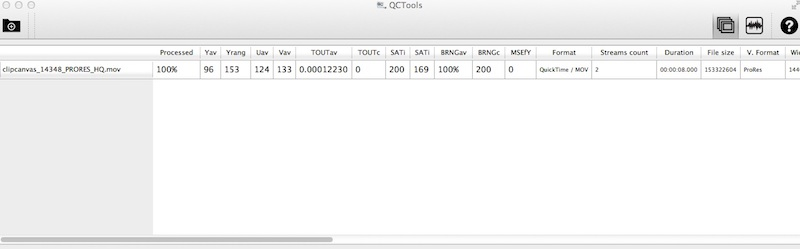

# How to Use

*   [Install](#install)
*   [Preferences](#preferences)
*   [Load Video Files](#load)
*   [Select Graph Filters](#select)
*   [View and Navigate Graphs](#view)
*   [Playback and Visual Analysis](#playback)
*   [Create/Export a Report](#create)
*   [Parts of the Tool](#parts)
*   [Data Analysis Window](#data)
*   [List View](#list)
*   [Video Analysis Window](#analysis)

## Install {#install}

Visit [https://bavc.org](https://bavc.org/preserve-media/preservation-tools) or [QCTools on Github](https://github.com/bavc/qctools) and download QCTools for your operating system (currently Windows, Mac OS X, and many Linux-based operating systems are supported). New releases of QCTools will be periodically available at BAVC. We encourage any issues, bugs, or ideas for QCTools to be submitted via our [issue tracker](https://github.com/bavc/qctools/issues).

## Preferences {#preferences}

QCTools provides a Preferences window to configure settings for running QCTools.

### Filters

QCTool's analysis methods depend on filters from FFmpeg's libavfilter library. The "Filters" tab allows filters to be enabled or disabled. Currently this includes: 

| filter name | track type | application in QCTools |
| [signalstats](http://ffmpeg.org/ffmpeg-filters.html#signalstats) | video | The `signalstats` analysis filter generates data to plot statistics on video signal levels, frame-to-frame differences, saturation and hue averages, and quantifications of visual patterns and errors. It is highly recommended to enable this filter. |
| [cropdetect](http://ffmpeg.org/ffmpeg-filters.html#cropdetect) | video | The cropdetect filter is used to determine how many columns and rows of nearly-black pixels border the visual image of the frame. The filter can detect changes in framing, letterboxing, pillarboxing, and adjustments to the aperture of the image. |
| [PSNR](http://ffmpeg.org/ffmpeg-filters.html#psnr) | video | The PSNR filter is used in QCTools specifically to generate a comparison between the two fields of the frame. The resulting data documents how different the fields are (which can find head-clogs or other videotape playback errors). |
| [SSIM](http://ffmpeg.org/ffmpeg-filters.html#ssim) | video | The SSIM filter is used in QCTools specifically to generate a comparison between the two fields of the frame. The resulting data documents how different the fields are (which can find head-clogs or other videotape playback errors). It is similar to PSNR but usually a different visual comparison algorithm. |
| [astats](http://ffmpeg.org/ffmpeg-filters.html#astats) | audio | The `astats` filter compiles statistics on audio data for small units of time, including maximum and minimum audio levels, DC Offset, the amount of consecutive audio sample differences, and RMS data. |
| [aphasemeter](http://ffmpeg.org/ffmpeg-filters.html#aphasemeter) | audio | The audio phase value represents the mean phase of current audio frame. Value is in range [-1, 1]. The -1 means left and right channels are completely out of phase and 1 means channels are in phase. |
| [EBU R.128](http://ffmpeg.org/ffmpeg-filters.html#ebur128) | audio | The EBU R.128 filter provides data on the perceived loudness of audio volume. |

Enabling all filters naturally provides more data, but results in a slower analysis and larger files. The EBU R.128 values represent perceived volume whereas the `astats` filters include metrics on actual volume (so the use of EBU R128 may not be considered essential if `astats` is in use). Additionally `PSNR` and `SSIM` both cover similar metrics by quantifying the difference between the two fields of the frame (the image of the odd-numbered lines vs the image of the even-numbered lines); `SSIM` is recommended.

### Tracks

The 'Tracks' Preference pane allows the user to set if they would like to analyze only the first track or all tracks of video and audio. Setting QCTools to analyze only the first track will result in a faster analyze but the other tracks would be ignored.

### Signalserver

QCTools now offers [SignalServer](https://github.com/bavc/signalserver) integration, allowing users to automatically or manually upload QCTools Reports as they are created by the application. Detailed signalserver installation instructions can be found [here](https://github.com/bavc/signalserver/blob/master/README.md). Installation will vary based upon your specific technical infrastructure. Though designed for a Linux server environment, SignalServer can be installed on a local computer via docker.

Once SignalServer has been properly [installed](https://github.com/bavc/signalserver/blob/master/README.md),and you’ve created a personal account, you’ll need to connect it to QCTools. You can do so by clicking on the menu bar at the top left of the QCTools screen and selecting Preferences (keyboard shortcut: #,). Under the SignalServer tab, fill in the following: the unique URL of your SignalServer app, and your user name and password. 

## Load Video Files {#load}

QCTools can currently accommodate several video file types including QuickTime, MXF, AVI, Matroska, MP4, and many other audiovisual file formats. Once the QCTools application is open you may identify selected video files for QCTools analysis in three ways:

1.  Simply drag a video file (or files) into the QCTools window. Note that you may import multiple files at once into the tool, though depending on the number and size of the files, processing speed may be affected.
2.  Double click the folder icon on the upper left. This launches a window from which you can browse and select video files.
3.  Navigating to File-->Open.

As files are opened QCTools will begin immediately processing them. This involves creating thumbnails, decoding audiovisual data, and analyzing that data through FFmpeg's signalstats filter.

## Select Graph Filters {#select}

By clicking the graph checkboxes you can select particular audiovisual metrics that you wish to analyze and display. You may make these selections before uploading your video or at any time after the QCTools analysis has been done and the graph display will update dynamically. As a default, 'Y values', 'U values', 'V values', 'Diffs', and 'Sat' (saturation) are selected. To begin, you may also want to select the **Temporal Outliers** (tout) Graph Filter. This will detect any large discrepancies between pixels and can provide an initial, high-level overview of potential errors.

For descriptions of each Filter and how to read graph values, please see the Help Section, denoted by the '?' icon in the toolbox portion of the application.

## View and Navigate Graphs {#view}

Graphs display on the top portion of the screen, corresponding video thumbnails show below. The video frames may be navigated via the next, previous, or playback buttons; the frame and time for the particular selection will be displayed. Clicking and dragging your cursor over a portion of the graph will cause the thumbnails below to update accordingly. You may also double click a specific thumbnail and the playback window will appear displaying the image and with a variety of analytical playback filters.

Scrubbing your cursor over a particular point on a graph will reveal the corresponding thumbnails in the thumbnail bar along with the frame number and the timestamp of the particular place in the video you have navigated to.

You may also use the '+' and '-' icons in the tool box section of the application to zoom in/out, giving you a more or less detailed view of the graph displays, over a specific timespan of the uploaded video.

You can also 'play' the window within the graph view. When playing the graph's cursor which shows the currently selected frame will scroll to the right while the corresponding thumbnails update in the thumbnail bar below.

Some helpful **keyboard shortcuts** you may want to use are:

*   'j' - To rewind
*   'k' - To pause
*   'l' - To Fast Forward
*   'f' - To enlarge the window to full screen
*   space bar - Toggle between play and pause
*   left - Select the previous frame
*   right - Select the next frame

## Playback and Visual Analysis {#playback}

By clicking on a thumbnail, you can open the preview window. The preview window serves as a playback environment that allows spot checking and manual video analysis. The preview window contains two playback windows that can be set to various selections; the filters allow the video to be processed in one of many ways which may help make particular issues more discernible. See the **Playback Filters** page for more details on these playback filters.

When playing back a media file please note that QCTools will only render the video. The audio may be visualized in one of the Audio Playback Filters but the audio will not be presently aurally.

Under situations where QCTools is not able to play back the video in real-time (for instance because the video is very large or the processing power available is not sufficient), there are options under the "View" toolbar menu to determine how playback should be prioritized under limited resources. Selecting "View>Play All Frames" will slow down the presentation of the video such that every frame can be displayed so that no frames are missed. By selecting "View>Play at Frame Rate" frames will be dropped during playback, if needed, in order to sustain the file's playback frame rate.

## Create/Export a Report {#create}

When an analysis (which may be time consuming, depending on the length of the file) is complete the analysis data may then be exported to a compressed XML file for future use. At a later point, the video may be reviewed again simply by opening the XML file--using the **Import** menu, or dragging and dropping the XML into QCTools--instead of having to reload/ reanalyze the video file itself; this process will take considerably less time. Additionally, this file may be opened in other environments such as standard spreadsheet or database applications.
QCTools also can export analytical metadata per frame in a [CSV](http://en.wikipedia.org/wiki/Comma-separated_values) document but the compressed [XML](http://en.wikipedia.org/wiki/XML) report is recommended since it can be reloaded into QCTools. Please see 'Data Format' tab for more information on the XML file compression and resulting file.
To **Export**:

*   Navigate to: Export-->To .qctools.xml.gz.../CSV, etc.
*   Click the 'CSV' icon in the toolbox section of the application.

Both options will prompt you to name your file and select a select a location.
To **Import**:

*   Navigate to: Import --> From .qctools.xml.gz...
*   Drag and drop file(s) into main QCTools window

## Parts of the Tool {#parts}

### Graph Window:

This view displays the filename, graph selections, X-Axis value selector, and the frame navigator buttons.

Descriptions of a graphs are reveals as tooltips when hovering your cursor over the graph checkboxes:

### Table View:

The Table View enables you to view the progress of your file download, plus associated metadata:

In addition to technical metadata about the file (duration, frame rate, file size, etc.) the List View also displays more detailed statistics:

| Column Name | Description |
| Yav | The average of the Y values |
| Yrang | The average of the YHIGH and YLOW values, which indicates the overall range of contrast |
| Uav | The average of the U values |
| Vav | The average of the V values |
| TOUTav | The average of the TOUT values |
| SATb | The number of frames where the maximum saturation is over 88.7, which would indicate levels outside of the broadcast range |
| SATi | The number of frames where the maximum saturation is over 118.2, which would indicate levels outside the legal YUV values |
| BRNGav | The percentage of frames with a BRNG value of more than zero |
| BRNGc | The number of frames with a BRNG value greater than zero |
| MSEfY | The number of frames with an MSEfY value over 1000 |

## Video Analysis Window {#analysis}

Many playback filters will use contextual options to tweak them, please review the Playback Filters section of the help documentation for more details.
