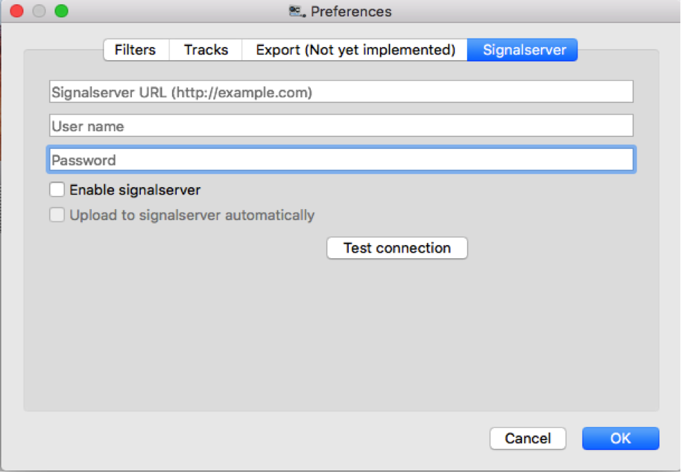

# SignalServer Integration

QCTools now offers [SignalServer](https://github.com/bavc/signalserver) integration, allowing users to automatically or manually upload QCTools Reports as they are created by the application. 

Once SignalServer has been properly [installed](https://github.com/bavc/signalserver/blob/master/README.md),and you’ve created a personal account, you’ll need to connect it to QCTools. You can do so by clicking on the menu bar at the top left of the QCTools screen and selecting Preferences (keyboard shortcut: #,). Under the SignalServer tab, fill in the following: the unique URL of your SignalServer app, and your user name and password. 

### SignalServer Installation

Detailed signalserver installation instructions can be found [here](https://github.com/bavc/signalserver/blob/master/README.md). Installation will vary based upon your specific technical infrastructure. Though designed for a Linux server environment, SignalServer can be installed on a local computer.

